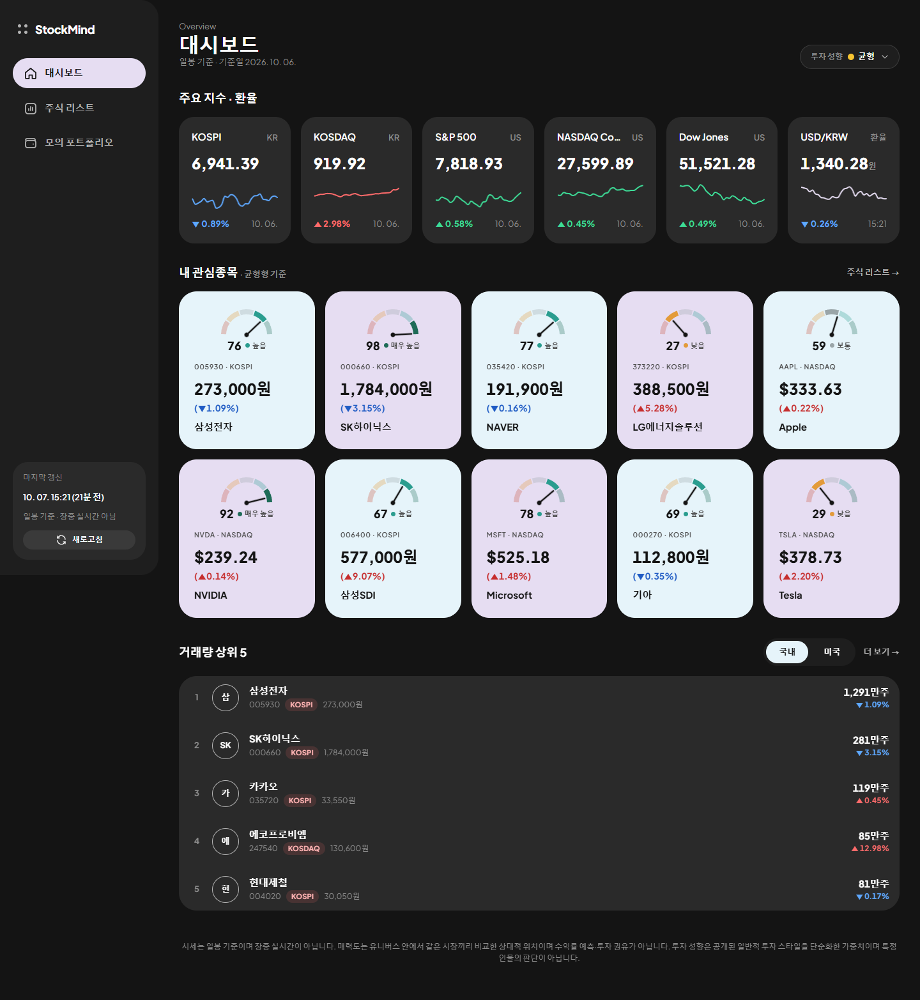

# 주식 분석 대시보드 (Stock Board)

국내(KOSPI·KOSDAQ)·미국(NASDAQ) 25개 종목의 시세·지수·환율·재무·공시를 수집·전처리해 PostgreSQL에 구조화하고, FastAPI 조회·분석 API와 바닐라 HTML/CSS/JS 대시보드로 제공하는 1차 세미프로젝트입니다.

> 시세는 **일봉 기준**(장중 실시간 아님)이며, 매력도·모의 포트폴리오를 포함한 모든 정보는 **투자 권유가 아닙니다**.
>
> 1차는 **로그인 없는 단일 사용자(데모) 모드**로, **로컬·시연 전용**입니다. 인증이 없으므로 외부에 공개된 서버로 배포하지 마세요.



## 주요 기능
| 화면 | 기능 |
|---|---|
| 대시보드 홈 `/` | 주요 지수 5개·USD/KRW(30일 스파크라인), 내 관심종목 카드, 거래량 상위 5 |
| 주식 리스트 `/stocks` | 시장 탭·거래량/시가총액(원화 환산) 순위·검색·경쟁 그룹 필터, ★ 관심 토글, 포트폴리오 담기 |
| 종목 상세 `/stocks/{market}/{ticker}` | 가격 차트, 핵심 지표, 매력도(팩터별), 수치 분석(수익률·변동성·MDD·120일선 괴리율), FY 재무 추이, 경쟁 종목 비교(그룹 내 순위·평균, 기준일=100 추이), 최근 공시 |
| 모의 포트폴리오 `/portfolio` | 시드 설정, 수량/금액/비중으로 담기(미리보기), 시드 초과 방어, 평가손익과 환율 효과 분리, 비중 차트 |

## 기술 스택
Python 3.12 · FastAPI · SQLAlchemy 2.x(동기) · Pydantic v2 · psycopg 3 · PostgreSQL 16(docker-compose) · pytest · 바닐라 JS(ES Modules, 빌드 없음) · Chart.js(CDN) · Google Fonts

## 1. 설치
```bash
python3.12 -m venv .venv && source .venv/bin/activate
pip install -r requirements.txt
cp .env.example .env          # 아래 환경변수 입력
docker compose up -d db       # PostgreSQL 16 → localhost:5433 (stockdb, stockdb_test 자동 생성)
```

## 2. 환경변수 (`.env`)
| 변수 | 설명 |
|---|---|
| `DATABASE_URL` / `TEST_DATABASE_URL` | 운영·테스트 DB (기본 포트 5433 — 로컬의 다른 PostgreSQL과 충돌 방지) |
| `PRICE_SOURCE_KR` | 국내 시세·지수·밸류에이션 소스 `pykrx`(기본) / `yfinance` |
| `KRX_ID`, `KRX_PW` | pykrx 1.2.x의 시총·PER/PBR·지수 조회에 필요한 KRX 정보데이터시스템 계정 |
| `REFRESH_TTL_HOURS` | 같은 종류 외부 호출 최소 간격(3~4, 기본 4) |
| `DART_API_KEY` | OpenDART 인증키 |
| `SEC_USER_AGENT` | `"앱이름 이메일"` 형식 (SEC는 API 키가 없고 연락처 포함 User-Agent 필수) |
| `LOG_LEVEL` | 기본 INFO |
| `DEFAULT_USER_ID` | 단일 사용자 모드에서 모든 요청을 처리할 사용자 (기본 1 = demo) |

## 3. 데이터 적재
```bash
python -m app.ingest.smoke            # (선택) 외부 소스 동작 확인 → docs/smoke_test_result.md
python -m app.ingest init-db          # db/schema.sql → indexes.sql → views.sql  (--reset: 스키마 재생성)
python -m app.ingest all              # 아래 1~7 전체 (빈 DB 기준 실측 257초)
python -m app.ingest scores           # 매력도 점수 계산 (config/scoring.yaml 가중치)
python -m app.ingest seed-demo        # demo 사용자의 관심종목 8건 + 모의 포트폴리오 2개
python -m app.ingest status           # 테이블별 행 수·기간·최근 실패
```
| 순서 | 명령 | 내용 | 소스 |
|---|---|---|---|
| 1 | `master [--offline]` | universe.yaml → 시장·종목·경쟁 그룹·지수, demo 사용자, DART corp_code·SEC CIK 매핑 | DART, SEC |
| 2 | `prices [--full] [--tickers …]` | 종목 일봉 2년(수정주가), 기본은 증분 | pykrx / yfinance |
| 3 | `indices [--full]` | 지수 일봉 2년 | pykrx / yfinance |
| 4 | `fx [--full]` | USD/KRW 일별 2년 | yfinance |
| 5 | `financials [--years 5]` | FY 5개년 재무(국내 연결) | DART / SEC + yfinance 보완 |
| 6 | `valuation [--full]` | KR 일별 1년, US 스냅샷 | pykrx / yfinance |
| 7 | `disclosures [--days 365]` | 최근 1년 공시(지분공시·Form 4 제외) | DART / SEC |

- 호출 간격 0.25~0.7초, 실패 시 지수 백오프(1·2·4초) 최대 3회 재시도
- 대상(종목·지수)마다 `ingestion_logs`에 결과 기록, 한 종목이 실패해도 나머지는 계속 적재
- upsert(`ON CONFLICT DO UPDATE`)라 재실행해도 행 수 불변, 이상 행은 버리지 않고 `data/quarantine/*.csv`에 사유와 함께 보관

### 샘플 데이터로 재현 (외부 호출·API 키 없이)
`sample_data/`에 반도체 그룹 4종목(삼성전자·SK하이닉스·AAPL·NVDA) × 최근 6개월 + 지수·환율 6개월 + FY 재무·공시가 있습니다.
```bash
python -m app.ingest init-db --reset
python -m app.ingest master --offline
python -m app.ingest import-sample
python -m app.ingest scores
python -m app.ingest seed-demo        # 시세가 없는 종목·포트폴리오는 건너뛰고 보고 (샘플: 포트폴리오 1개·4종목)
python -m app.ingest export-sample    # (전체 적재된 DB에서) 샘플 다시 만들기
```
샘플에는 4종목만 시세가 있어 나머지 21종목은 화면에서 '데이터 없음'으로 보입니다.

## 4. 실행
```bash
uvicorn app.main:app --reload
```
- 화면: http://localhost:8000/ · `/stocks` · `/stocks/KOSPI/005930` · `/portfolio`
- API 문서(Swagger): http://localhost:8000/docs — API는 `/api/v1` 아래
- 사용자: 인증 없음(단일 사용자·데모 모드). 요청 사용자는 서버의 `get_current_user_id()`가 `DEFAULT_USER_ID`로 정하며, API는 `user_id`를 받지 않습니다. 포트폴리오·관심종목은 소유자만 접근할 수 있고 남의 리소스는 404입니다. 로그인은 2차에서 이 함수를 JWT 검증으로 교체해 도입합니다
- 오류 응답은 `{"error": {"code", "message", "detail"}}`, 모든 응답에 `X-Request-ID` 헤더

### 갱신 정책 (앱 내부 스케줄러 없음)
- 환율·지수·종목 일봉·밸류에이션·점수는 **작업 종류별 `REFRESH_TTL_HOURS`(기본 4시간)에 최대 1회**만 외부 호출합니다.
- 사이드바 새로고침(`POST /api/v1/market/refresh`)과 `python -m app.ingest refresh`는 TTL 이내 작업을 `SKIPPED`로 기록하고 외부 호출 없이 현재 상태를 돌려줍니다.
- 환율은 TTL이 지났을 때 한 번만 조회해 저장하며(동시 요청은 advisory lock으로 한 번만), 실패하면 마지막 값과 `fx_stale: true`를 응답합니다.
- 주기 실행이 필요하면 cron 예시:
```cron
0 */4 * * * cd /path/to/ax_semi && .venv/bin/python -m app.ingest refresh >> data/refresh.log 2>&1
```

## 5. 테스트
```bash
pytest -q                              # 103 passed — TEST_DATABASE_URL(stockdb_test), 외부 호출 없음(fake provider)
python -m app.ingest explain           # 인덱스 전후 EXPLAIN 비교 → docs/explain_result.md
```
DB 제약·전처리·TTL 갱신(외부 호출 횟수)·분석 SQL 손계산·포트폴리오 명세 시나리오·동시성·화면 흐름을 검증합니다. 결과는 [docs/07](docs/07_테스트_결과서.md).

## 6. 저장소 구조
```
app/
  api/        라우터 — market, stocks, watchlist, portfolios, analysis(분석·통계)
  core/       설정, DB 세션, 오류 형식, 요청 ID 로깅
  models/     SQLAlchemy 모델 (db/schema.sql과 1:1)
  schemas/    Pydantic 요청·응답
  providers/  외부 소스 인터페이스 + pykrx·yfinance·DART·SEC 구현
  services/   환율(TTL·lock)·갱신·포트폴리오 계산·점수 생성
  ingest/     수집·전처리·적재 CLI (python -m app.ingest)
  queries/    조회·분석 SQL 원문 (text()로 실행)
web/          index.html · stocks.html · stock.html · portfolio.html, css/(tokens·base·components·pages), js/
db/           schema.sql · indexes.sql · views.sql · init/(테스트 DB 생성)
config/       universe.yaml(종목·지수·경쟁 그룹) · scoring.yaml(매력도 가중치)
sample_data/  재현용 소량 CSV
docs/         문서 01~08, ASSUMPTIONS, smoke test·EXPLAIN 결과, screenshots/
tests/        pytest
```

## 7. 문서
| 문서 | 내용 |
|---|---|
| [01 프로젝트 기획서](docs/01_프로젝트_기획서.md) | 배경·문제 정의·목적·기능·데이터·개발 환경 |
| [02 요구사항 정의서](docs/02_요구사항_정의서.md) | REQ-ID·중요도·구현 상태(근거 테스트 ID) |
| [03 데이터 조사·정의서](docs/03_데이터_조사_정의서.md) | 출처·원본/DB 컬럼·전처리·적재 결과 |
| [04 도메인 모델 정의서](docs/04_도메인_모델_정의서.md) | 명사 추출 → Entity → 속성 → 관계 |
| [05 ERD 및 DB 설계서](docs/05_ERD_및_DB설계서.md) | ERD·테이블 정의·정규화·의도적 비정규화·인덱스 EXPLAIN·SQL 요소 |
| [06 기능·API 정의서](docs/06_기능_API_정의서.md) | 엔드포인트 표·실제 요청/응답 예시·화면↔API |
| [07 테스트 결과서](docs/07_테스트_결과서.md) | pytest 결과·수동 UI 점검 체크리스트 |
| [08 최종 결과보고서](docs/08_최종_결과보고서.md) | 전체 정리·주요 SQL·문제 해결·회고·발표 흐름 |
| [ASSUMPTIONS](docs/ASSUMPTIONS.md) | 가정·결정·미확인 사항 |

## 8. 데이터 출처와 이용 조건
| 출처 | 용도 | 비고 |
|---|---|---|
| pykrx (KRX 정보데이터시스템, 비공식) | KR 일봉·지수·시총·PER/PBR (기본) | 1.2.x는 시총·펀더멘털·지수에 KRX 회원 로그인 필요 |
| yfinance (Yahoo Finance, 비공식) | US 일봉·지수·밸류에이션, 환율, KR 대체 소스 | 개인·학습 목적, 원본 재배포 안 함 |
| OpenDART (금융감독원) | KR 재무(연결)·공시 | 인증키 필요, 일일 호출 한도 |
| SEC EDGAR | US 재무(XBRL companyfacts)·공시 | API 키 없음, 이메일 포함 User-Agent 필수 |

pykrx·yfinance는 비공식 라이브러리로 사이트 변경 시 동작하지 않을 수 있으며, 데이터 이용 조건은 각 원 사이트(KRX, Yahoo) 약관을 따릅니다. 저장소에는 소량 샘플만 커밋하고 전체 데이터는 적재 스크립트로 생성합니다.

## 9. 한계
- 인증 없음: 1차는 단일 사용자(데모) 모드로 로컬·시연 전용. 로그인은 2차 범위
- 시세는 일봉 기준(장중 실시간 아님). 장 마감 전 당일 봉은 적재하지 않음
- 증분 적재는 과거 수정주가의 소급 조정(배당·분할)을 반영하지 못함 → 필요 시 `prices --full`
- 재무는 KR K-IFRS 연결·US US-GAAP로 회계기준이 다름. 일부 연도·항목은 원천에 값이 없어 NULL(ASSUMPTIONS A-41)
- KRX 제공 PER/EPS의 산정 기준은 DART 연결 재무 기반 계산과 다를 수 있음(A-38)
- 매력도는 25종목 유니버스 안에서 같은 시장끼리 비교한 상대평가
- 미구현 선택 기능: 분기 재무, 투자 스타일 체크리스트, 시나리오 API, 관심종목 균등 배분 미리보기, 관심종목 정렬 변경 화면(API는 있음)
