# 05. ERD 및 DB 설계서

- DDL 원문: `db/schema.sql` → `db/indexes.sql` → `db/views.sql` 순서로 실행
- DBMS: PostgreSQL 16 / 테이블 20개, VIEW 3개, 보조 인덱스 10개(명세 10개 − 중복 1개 + 추가 1개), 부분 UNIQUE 인덱스 1개(주 그룹 제약), 트리거 2개
- 매력도 테이블(`scoring_presets`·`scoring_weights`·`stock_metric_values`·`stock_scores`, `peer_group_members.is_primary`)은 다중 팩터 모델로 바꾸며 추가·재정의했다(2026-10-07, `db/migrations/001_scoring_v2.sql`, 계산 정의는 `docs/09`).
- 3절 테이블 정의는 테스트 DB에 DDL을 실제 적용한 뒤 시스템 카탈로그(`pg_attribute`, `pg_constraint`)에서 생성했다.

## 1. ERD

```mermaid
erDiagram
    markets ||--o{ stocks : "상장"
    markets |o--o{ indices : "대표 지수"
    stocks ||--o{ peer_group_members : ""
    peer_groups ||--o{ peer_group_members : ""
    stocks ||--o{ daily_prices : "일봉"
    stocks ||--o{ valuation_snapshots : "밸류에이션"
    stocks ||--o{ financial_statements : "재무"
    stocks ||--o{ disclosures : "공시"
    stocks ||--o{ stock_metric_values : "지표 원값·Z"
    stocks ||--o{ stock_scores : "매력도"
    scoring_presets ||--o{ scoring_weights : "가중치"
    scoring_presets ||--o{ stock_scores : "프리셋"
    indices ||--o{ index_daily_prices : "지수 일봉"
    users ||--o{ watchlist_items : ""
    stocks ||--o{ watchlist_items : ""
    users ||--o{ portfolios : "소유"
    portfolios ||--o{ portfolio_items : "담기"
    stocks ||--o{ portfolio_items : "RESTRICT"
    stocks |o--o{ ingestion_logs : "SET NULL"

    markets {
        smallint market_id PK
        varchar code UK
        char country
        char currency
        varchar timezone
    }
    stocks {
        int stock_id PK
        smallint market_id FK
        varchar ticker
        varchar name
        varchar name_en
        varchar corp_code
        varchar cik
        boolean is_active
    }
    peer_groups {
        int group_id PK
        varchar name UK
        text description
    }
    peer_group_members {
        int group_id PK,FK
        int stock_id PK,FK
        boolean is_primary
    }
    daily_prices {
        int stock_id PK,FK
        date trade_date PK
        numeric open
        numeric high
        numeric low
        numeric close
        bigint volume
    }
    valuation_snapshots {
        int stock_id PK,FK
        date as_of PK
        numeric per
        numeric pbr
        numeric eps
        numeric bps
        numeric market_cap
        bigint shares_outstanding
        varchar source
    }
    financial_statements {
        int fin_id PK
        int stock_id FK
        date period_end
        varchar period_type
        numeric revenue
        numeric operating_income
        numeric net_income
        numeric total_assets
        numeric total_equity
        numeric total_debt
        varchar data_source
        varchar accounting_std
    }
    disclosures {
        int disclosure_id PK
        int stock_id FK
        varchar rcept_no UK
        text title
        varchar report_type
        timestamptz filed_at
        text url
        varchar data_source
    }
    indices {
        smallint index_id PK
        varchar code UK
        varchar name
        smallint market_id FK
        varchar source_symbol
        smallint display_order
    }
    index_daily_prices {
        smallint index_id PK,FK
        date trade_date PK
        numeric open
        numeric high
        numeric low
        numeric close
    }
    fx_rates {
        int fx_id PK
        timestamptz rate_at
        numeric usd_krw
        varchar granularity
        varchar source
    }
    users {
        int user_id PK
        varchar nickname UK
        timestamptz created_at
    }
    watchlist_items {
        int user_id PK,FK
        int stock_id PK,FK
        int sort_order
        timestamptz added_at
    }
    portfolios {
        int portfolio_id PK
        int user_id FK
        varchar name
        numeric seed_krw
        timestamptz created_at
        timestamptz updated_at
    }
    portfolio_items {
        int item_id PK
        int portfolio_id FK
        int stock_id FK
        int quantity
        numeric ref_price
        numeric ref_fx_rate
        date ref_date
        text memo
        numeric cost_krw "GENERATED"
        timestamptz created_at
        timestamptz updated_at
    }
    scoring_presets {
        smallint preset_id PK
        varchar code UK
        varchar name
        text description
        smallint sort_order
    }
    scoring_weights {
        smallint preset_id PK,FK
        varchar factor PK
        numeric weight
    }
    stock_metric_values {
        int stock_id PK,FK
        date as_of PK
        varchar metric PK
        varchar factor
        numeric raw_value
        numeric z_raw
        numeric z_adj
    }
    stock_scores {
        int stock_id PK,FK
        date as_of PK
        smallint preset_id PK,FK
        numeric value_score
        numeric quality_score
        numeric growth_score
        numeric safety_score
        numeric momentum_score
        numeric composite
        numeric score
        smallint factor_coverage
        jsonb data_quality
    }
    ingestion_logs {
        int log_id PK
        varchar source
        varchar job_type
        int stock_id FK
        varchar status
        int rows_loaded
        text error
        timestamptz started_at
        timestamptz finished_at
    }
```

`fx_rates`는 FK 관계가 없는 독립 테이블이다(조회 시점에 참조하며, 담은 시점 환율은 `portfolio_items`에 복사 — 5절).

## 2. 테이블 목록
행 수는 2026-10-06 전체 적재 후 운영 DB(`python -m app.ingest status`) 기준이다.

| 영역 | 테이블 | 설명 | PK | 행 수 |
|---|---|---|---|---|
| 마스터 | markets | 시장(통화·국가·시간대) | market_id | 4 |
| 마스터 | stocks | 종목 | stock_id | 25 |
| 마스터 | peer_groups | 경쟁 그룹 | group_id | 8 |
| 마스터 | peer_group_members | 종목↔그룹 N:M, 주 그룹 표시 | (group_id, stock_id) | 25 (주 그룹 25) |
| 시계열 | daily_prices | 종목 일봉(수정주가) | (stock_id, trade_date) | 12,276 |
| 시계열 | valuation_snapshots | PER·PBR·시총 스냅샷 | (stock_id, as_of) | 3,881 (KR 16×242일 + US 9) |
| 재무 | financial_statements | 재무제표(FY) | fin_id | 125 (25×5) |
| 공시 | disclosures | 공시 목록(최근 1년) | disclosure_id | 1,349 (DART 1,170 · SEC 179) |
| 배경 | indices | 지수 정의 | index_id | 5 |
| 배경 | index_daily_prices | 지수 일봉 | (index_id, trade_date) | 2,472 |
| 배경 | fx_rates | USD/KRW | fx_id | DAILY 517 + SNAPSHOT |
| 사용자 | users | 사용자(인증 없음) | user_id | 1 (demo) |
| 사용자 | watchlist_items | 관심종목 N:M | (user_id, stock_id) | 8 |
| 사용자 | portfolios | 모의 포트폴리오 | portfolio_id | 2 |
| 사용자 | portfolio_items | 담은 종목 | item_id | 11 (6 + 5, KRW·USD 혼합) |
| 설정 | scoring_presets | 매력도 가중치 프리셋 | preset_id | 4 |
| 설정 | scoring_weights | 프리셋별 팩터 가중치 | (preset_id, factor) | 20 (4×5) |
| 파생 | stock_metric_values | 매력도 지표 원값·Z | (stock_id, as_of, metric) | 225 (25×9, as_of 2026-10-07) |
| 파생 | stock_scores | 프리셋별 매력도 점수 | (stock_id, as_of, preset_id) | 100 (25×4, as_of 2026-10-07) |
| 운영 | ingestion_logs | 적재·갱신 로그 | log_id | 적재·갱신마다 증가 |

## 3. 테이블 정의서

#### `markets`

| 컬럼 | 타입 | NULL | 기본값/생성식 | 키 | 설명 |
|---|---|---|---|---|---|
| market_id | smallint | N | 자동 증가 | PK | 시장 ID |
| code | character varying(10) | N |  | UQ | KOSPI / KOSDAQ / NASDAQ / NYSE |
| country | character(2) | N |  |  | 국가 (KR/US) |
| currency | character(3) | N |  |  | 통화 (KRW/USD) |
| timezone | character varying(40) | N |  |  | Asia/Seoul / America/New_York |

제약: `CHECK ((country = ANY (ARRAY['KR'::bpchar, 'US'::bpchar])))` / `CHECK ((currency = ANY (ARRAY['KRW'::bpchar, 'USD'::bpchar])))`

#### `stocks`

| 컬럼 | 타입 | NULL | 기본값/생성식 | 키 | 설명 |
|---|---|---|---|---|---|
| stock_id | integer | N | 자동 증가 | PK | 종목 ID |
| market_id | smallint | N |  | UQ(복합), FK→markets | 시장 ID |
| ticker | character varying(16) | N |  | UQ(복합) | 거래소 종목 코드 |
| name | character varying(128) | N |  |  | 이름 |
| name_en | character varying(128) | Y |  |  | 영문 이름 |
| corp_code | character varying(16) | Y |  |  | OpenDART 고유번호 (KR) |
| cik | character varying(10) | Y |  |  | SEC CIK 10자리 (US) |
| is_active | boolean | N | true |  | 수집 대상 여부 |

제약: `UNIQUE (market_id, ticker)`

#### `peer_groups`

| 컬럼 | 타입 | NULL | 기본값/생성식 | 키 | 설명 |
|---|---|---|---|---|---|
| group_id | integer | N | 자동 증가 | PK | 경쟁 그룹 ID |
| name | character varying(64) | N |  | UQ | 이름 |
| description | text | Y |  |  | 설명 |

#### `peer_group_members`

| 컬럼 | 타입 | NULL | 기본값/생성식 | 키 | 설명 |
|---|---|---|---|---|---|
| group_id | integer | N |  | PK, FK→peer_groups (CASCADE) | 경쟁 그룹 ID |
| stock_id | integer | N |  | PK, FK→stocks (CASCADE) | 종목 ID |
| is_primary | boolean | N | false |  | 매력도 섹터 중립화의 주 그룹 여부 |

제약: 부분 UNIQUE 인덱스 `CREATE UNIQUE INDEX ux_pgm_primary ON peer_group_members (stock_id) WHERE is_primary` — 종목당 주 그룹 최대 1개

#### `daily_prices`

| 컬럼 | 타입 | NULL | 기본값/생성식 | 키 | 설명 |
|---|---|---|---|---|---|
| stock_id | integer | N |  | PK, FK→stocks (CASCADE) | 종목 ID |
| trade_date | date | N |  | PK | 시장 현지 날짜 |
| open | numeric(18,4) | N |  |  | 시가 |
| high | numeric(18,4) | N |  |  | 고가 |
| low | numeric(18,4) | N |  |  | 저가 |
| close | numeric(18,4) | N |  |  | 수정주가 |
| volume | bigint | N |  |  | 거래량(주) |

제약: `CHECK ((volume >= 0))` / `CHECK ((high >= low))` / `CHECK ((low > (0)::numeric))`

#### `valuation_snapshots`

| 컬럼 | 타입 | NULL | 기본값/생성식 | 키 | 설명 |
|---|---|---|---|---|---|
| stock_id | integer | N |  | PK, FK→stocks (CASCADE) | 종목 ID |
| as_of | date | N |  | PK | 기준일 |
| per | numeric(18,4) | Y |  |  | 적자·미제공은 NULL |
| pbr | numeric(18,4) | Y |  |  | 주가순자산비율 |
| eps | numeric(18,4) | Y |  |  | 주당순이익 |
| bps | numeric(18,4) | Y |  |  | 주당순자산 |
| market_cap | numeric(26,0) | Y |  |  | 종목 통화 기준 |
| shares_outstanding | bigint | Y |  |  | 발행(상장)주식수 |
| source | character varying(20) | N |  |  | 데이터 출처 |

제약: `CHECK ((market_cap >= (0)::numeric))` / `CHECK ((shares_outstanding >= 0))` / `CHECK (((source)::text = ANY ((ARRAY['PYKRX'::character varying, 'YFINANCE'::character varying, 'DERIVED'::character varying])::text[])))`

#### `financial_statements`

| 컬럼 | 타입 | NULL | 기본값/생성식 | 키 | 설명 |
|---|---|---|---|---|---|
| fin_id | integer | N | 자동 증가 | PK | 재무 행 ID |
| stock_id | integer | N |  | UQ(복합), FK→stocks (CASCADE) | 종목 ID |
| period_end | date | N |  | UQ(복합) | 결산일 |
| period_type | character varying(4) | N |  | UQ(복합) | FY / Q1~Q4 |
| revenue | numeric(24,2) | Y |  |  | 매출액 |
| operating_income | numeric(24,2) | Y |  |  | 영업이익 |
| net_income | numeric(24,2) | Y |  |  | 지배기업 소유주 귀속 우선 |
| total_assets | numeric(24,2) | Y |  |  | 자산총계 |
| total_equity | numeric(24,2) | Y |  |  | 지배기업 소유주 귀속 우선 |
| total_debt | numeric(24,2) | Y |  |  | 부채총계 (KR Liabilities / US Liabilities) |
| data_source | character varying(20) | N |  |  | 데이터 출처 |
| accounting_std | character varying(20) | Y |  |  | K-IFRS / US-GAAP |

제약: `CHECK (((period_type)::text = ANY ((ARRAY['FY'::character varying, 'Q1'::character varying, 'Q2'::character varying, 'Q3'::character varying, 'Q4'::character varying])::text[])))` / `CHECK (((data_source)::text = ANY ((ARRAY['DART'::character varying, 'SEC'::character varying, 'YFINANCE'::character varying])::text[])))` / `UNIQUE (stock_id, period_end, period_type)`

#### `disclosures`

| 컬럼 | 타입 | NULL | 기본값/생성식 | 키 | 설명 |
|---|---|---|---|---|---|
| disclosure_id | integer | N | 자동 증가 | PK | 공시 ID |
| stock_id | integer | N |  | FK→stocks (CASCADE) | 종목 ID |
| rcept_no | character varying(64) | N |  | UQ | DART 접수번호 / SEC accession number |
| title | text | N |  |  | 공시 제목 |
| report_type | character varying(100) | Y |  |  | 보고서 유형/서식 |
| filed_at | timestamp with time zone | N |  |  | 접수(제출) 시각 |
| url | text | Y |  |  | 원문 링크 |
| data_source | character varying(20) | N |  |  | 데이터 출처 |

제약: `CHECK (((data_source)::text = ANY ((ARRAY['DART'::character varying, 'SEC'::character varying])::text[])))`

#### `indices`

| 컬럼 | 타입 | NULL | 기본값/생성식 | 키 | 설명 |
|---|---|---|---|---|---|
| index_id | smallint | N | 자동 증가 | PK | 지수 ID |
| code | character varying(16) | N |  | UQ | KOSPI / KOSDAQ / SPX / IXIC / DJI |
| name | character varying(64) | N |  |  | 이름 |
| market_id | smallint | Y |  | FK→markets | 시장 ID |
| source_symbol | character varying(32) | N |  |  | 라이브러리 조회용 심볼 (1001, ^GSPC …) |
| display_order | smallint | N | 0 |  | 화면 표시 순서 |

#### `index_daily_prices`

| 컬럼 | 타입 | NULL | 기본값/생성식 | 키 | 설명 |
|---|---|---|---|---|---|
| index_id | smallint | N |  | PK, FK→indices (CASCADE) | 지수 ID |
| trade_date | date | N |  | PK | 거래일(현지) |
| open | numeric(18,4) | Y |  |  | 시가 |
| high | numeric(18,4) | Y |  |  | 고가 |
| low | numeric(18,4) | Y |  |  | 저가 |
| close | numeric(18,4) | N |  |  | 종가 |

제약: `CHECK ((close > (0)::numeric))`

#### `fx_rates`

| 컬럼 | 타입 | NULL | 기본값/생성식 | 키 | 설명 |
|---|---|---|---|---|---|
| fx_id | integer | N | 자동 증가 | PK | 환율 행 ID |
| rate_at | timestamp with time zone | N |  | UQ(복합) | 환율 기준 시각 |
| usd_krw | numeric(12,4) | N |  |  | 1달러당 원 |
| granularity | character varying(8) | N |  | UQ(복합) | SNAPSHOT / DAILY |
| source | character varying(20) | N | 'YFINANCE'::character varying |  | 데이터 출처 |

제약: `CHECK ((usd_krw > (0)::numeric))` / `CHECK (((granularity)::text = ANY ((ARRAY['SNAPSHOT'::character varying, 'DAILY'::character varying])::text[])))` / `UNIQUE (granularity, rate_at)`

#### `users`

| 컬럼 | 타입 | NULL | 기본값/생성식 | 키 | 설명 |
|---|---|---|---|---|---|
| user_id | integer | N | 자동 증가 | PK | 사용자 ID |
| nickname | character varying(50) | N |  | UQ | 닉네임 |
| created_at | timestamp with time zone | N | now() |  | 생성 시각 |

#### `watchlist_items`

| 컬럼 | 타입 | NULL | 기본값/생성식 | 키 | 설명 |
|---|---|---|---|---|---|
| user_id | integer | N |  | PK, FK→users (CASCADE) | 사용자 ID |
| stock_id | integer | N |  | PK, FK→stocks (CASCADE) | 종목 ID |
| sort_order | integer | N | 0 |  | 표시 순서 |
| added_at | timestamp with time zone | N | now() |  | 추가 시각 |

#### `portfolios`

| 컬럼 | 타입 | NULL | 기본값/생성식 | 키 | 설명 |
|---|---|---|---|---|---|
| portfolio_id | integer | N | 자동 증가 | PK | 포트폴리오 ID |
| user_id | integer | N |  | UQ(복합), FK→users (CASCADE) | 사용자 ID |
| name | character varying(100) | N |  | UQ(복합) | 이름 |
| seed_krw | numeric(20,0) | N |  |  | 투자 시드(원) |
| created_at | timestamp with time zone | N | now() |  | 생성 시각 |
| updated_at | timestamp with time zone | N | now() |  | 수정 시각(트리거 갱신) |

제약: `CHECK ((seed_krw > (0)::numeric))` / `UNIQUE (user_id, name)`

#### `portfolio_items`

| 컬럼 | 타입 | NULL | 기본값/생성식 | 키 | 설명 |
|---|---|---|---|---|---|
| item_id | integer | N | 자동 증가 | PK | 담은 항목 ID |
| portfolio_id | integer | N |  | UQ(복합), FK→portfolios (CASCADE) | 포트폴리오 ID |
| stock_id | integer | N |  | UQ(복합), FK→stocks (RESTRICT) | 담긴 종목은 삭제 불가 |
| quantity | integer | N |  |  | 수량(정수 주) |
| ref_price | numeric(18,4) | N |  |  | 담은 시점 종가(종목 통화) |
| ref_fx_rate | numeric(12,4) | N | 1 |  | 담은 시점 환율 (KRW 종목은 1) |
| ref_date | date | N |  |  | ref_price의 거래일 |
| memo | text | Y |  |  | 메모 |
| created_at | timestamp with time zone | N | now() |  | 생성 시각 |
| updated_at | timestamp with time zone | N | now() |  | 수정 시각(트리거 갱신) |
| cost_krw | numeric(24,2) | Y | GENERATED: (((quantity)::numeric * ref_price) * ref_fx_rate) |  | 원가(원) |

제약: `CHECK ((quantity > 0))` / `CHECK ((ref_price > (0)::numeric))` / `CHECK ((ref_fx_rate > (0)::numeric))` / `UNIQUE (portfolio_id, stock_id)`

#### `scoring_presets`

| 컬럼 | 타입 | NULL | 기본값/생성식 | 키 | 설명 |
|---|---|---|---|---|---|
| preset_id | smallint | N | 자동 증가 | PK | 프리셋 ID |
| code | character varying(20) | N |  | UQ | aggressive / growth / balanced / value |
| name | character varying(50) | N |  |  | 화면 이름 (위험·성장·균형·가치) |
| description | text | Y |  |  | 설명 |
| sort_order | smallint | N | 0 |  | 화면 표시 순서 (위험 1 → 가치 4) |

`config/scoring.yaml`에서 적재(init-db·migrate·scores 실행 시). 프리셋별 가중치 합 = 1은 행 간 제약이라 적재 시 검증한다.

#### `scoring_weights`

| 컬럼 | 타입 | NULL | 기본값/생성식 | 키 | 설명 |
|---|---|---|---|---|---|
| preset_id | smallint | N |  | PK, FK→scoring_presets (CASCADE) | 프리셋 ID |
| factor | character varying(12) | N |  | PK | value / quality / growth / safety / momentum |
| weight | numeric(4,3) | N |  |  | 가중치 0~1 |

제약: `CHECK (((factor)::text = ANY ((ARRAY['value'::character varying, 'quality'::character varying, 'growth'::character varying, 'safety'::character varying, 'momentum'::character varying])::text[])))` / `CHECK (((weight >= (0)::numeric) AND (weight <= (1)::numeric)))`

#### `stock_metric_values`

| 컬럼 | 타입 | NULL | 기본값/생성식 | 키 | 설명 |
|---|---|---|---|---|---|
| stock_id | integer | N |  | PK, FK→stocks (CASCADE) | 종목 ID |
| as_of | date | N |  | PK | 기준일 |
| metric | character varying(24) | N |  | PK | 지표 (earnings_yield, book_yield, roe … 9종, docs/09 2절) |
| factor | character varying(12) | N |  |  | 소속 팩터 |
| raw_value | numeric | Y |  |  | 지표 원값, 계산 불가면 NULL |
| z_raw | numeric(8,4) | Y |  |  | 국가 내 로버스트 Z(방향 반영, ±3 클리핑) |
| z_adj | numeric(8,4) | Y |  |  | 주 그룹 축소 추정으로 섹터 중립화한 Z |

제약: `CHECK (((factor)::text = ANY ((ARRAY['value'::character varying, 'quality'::character varying, 'growth'::character varying, 'safety'::character varying, 'momentum'::character varying])::text[])))`

#### `stock_scores`

| 컬럼 | 타입 | NULL | 기본값/생성식 | 키 | 설명 |
|---|---|---|---|---|---|
| stock_id | integer | N |  | PK, FK→stocks (CASCADE) | 종목 ID |
| as_of | date | N |  | PK | 기준일 |
| preset_id | smallint | N |  | PK, FK→scoring_presets | 프리셋 ID |
| value_score | numeric(8,4) | Y |  |  | 가치 팩터 점수(유효 지표 z_adj 평균, Z 단위) |
| quality_score | numeric(8,4) | Y |  |  | 퀄리티 팩터 점수 |
| growth_score | numeric(8,4) | Y |  |  | 성장 팩터 점수 |
| safety_score | numeric(8,4) | Y |  |  | 안정성 팩터 점수 |
| momentum_score | numeric(8,4) | Y |  |  | 모멘텀 팩터 점수 |
| composite | numeric(8,4) | Y |  |  | 유효 팩터 가중 평균(재정규화), 유효 팩터 < 3이면 NULL |
| score | numeric(5,2) | Y |  |  | 0~100 = 100·Φ(국가 내 표준화한 composite) |
| factor_coverage | smallint | N |  |  | 유효 팩터 수 0~5 |
| data_quality | jsonb | N | '{}'::jsonb |  | 계산 불가 지표·팩터와 사유, 대체 계산 메모 |

제약: `CHECK (((factor_coverage >= 0) AND (factor_coverage <= 5)))` / `CHECK (((score >= (0)::numeric) AND (score <= (100)::numeric)))`

#### `ingestion_logs`

| 컬럼 | 타입 | NULL | 기본값/생성식 | 키 | 설명 |
|---|---|---|---|---|---|
| log_id | integer | N | 자동 증가 | PK | 로그 ID |
| source | character varying(20) | N |  |  | PYKRX / YFINANCE / DART / SEC / INTERNAL |
| job_type | character varying(30) | N |  |  | 작업 종류 |
| stock_id | integer | Y |  | FK→stocks (SET NULL) | 종목 단위 작업일 때만 |
| status | character varying(10) | N |  |  | SUCCESS / FAILED / SKIPPED |
| rows_loaded | integer | N | 0 |  | 적재 행 수 |
| error | text | Y |  |  | 실패 사유 / 격리 행 사유 |
| started_at | timestamp with time zone | N |  |  | 시작 시각 |
| finished_at | timestamp with time zone | Y |  |  | 종료 시각 |

제약: `CHECK (((job_type)::text = ANY ((ARRAY['PRICES'::character varying, 'INDICES'::character varying, 'FX'::character varying, 'VALUATION'::character varying, 'FINANCIALS'::character varying, 'DISCLOSURES'::character varying, 'SCORES'::character varying, 'MASTER'::character varying])::text[])))` / `CHECK (((status)::text = ANY ((ARRAY['SUCCESS'::character varying, 'FAILED'::character varying, 'SKIPPED'::character varying])::text[])))` / `CHECK ((rows_loaded >= 0))` / `CHECK (((finished_at IS NULL) OR (finished_at >= started_at)))`

## 4. 정규화

### 4-1. 1NF
모든 컬럼이 원자값이다. 경쟁 그룹 소속(종목 하나가 여러 그룹)이나 관심종목처럼 반복되는 값은 컬럼 목록(`group1, group2…`)이나 배열로 두지 않고 교차 테이블 행으로 분리했다. 유일한 JSONB 컬럼인 `stock_scores.data_quality`는 조회·조인 대상이 아닌 진단 메타데이터(계산 불가 팩터와 사유)여서 문서 단위로 저장한다.

### 4-2. 2NF
복합 PK를 가진 테이블(`daily_prices`, `valuation_snapshots`, `index_daily_prices`, `stock_metric_values`, `stock_scores`, `scoring_weights`, `peer_group_members`, `watchlist_items`)의 일반 속성은 PK 전체에 종속된다. `stock_metric_values.factor`는 `metric`에서 정해지는 값이지만, 파생 테이블(5-2)에서 팩터별 집계를 JOIN 없이 하기 위해 함께 저장한다. 예를 들어 `daily_prices.close`는 (종목, 날짜) 조합에 종속되며, 종목 이름처럼 `stock_id`에만 종속되는 속성은 이 테이블에 두지 않는다.

### 4-3. 3NF — `markets` 분리 (이행적 종속 제거)
`stocks`에 통화·국가·시간대를 두면 `stock_id → market → currency/country/timezone`의 이행적 종속이 생기고, 같은 시장 종목 수만큼 같은 값이 반복된다. 시장 단위 속성을 `markets`로 분리해 `stocks`는 `market_id`만 참조한다. 시장의 시간대를 바꿔도 한 행만 고치면 된다.

### 4-4. N:M 교차 테이블
| 관계 | 교차 테이블 | 속성 |
|---|---|---|
| 종목 ↔ 경쟁 그룹 | `peer_group_members` | `is_primary` (매력도 섹터 중립화의 주 그룹, 종목당 최대 1개) |
| 사용자 ↔ 종목 (관심종목) | `watchlist_items` | `sort_order`, `added_at` |

### 4-5. 파생값은 저장하지 않음 (VIEW)
수익률·변동성·MDD·이동평균·52주 위치·거래량 비율·영업이익률·ROE·YoY·시총 원화 환산은 원천 데이터에서 언제든 계산할 수 있으므로 테이블에 저장하지 않고 `v_stock_metrics` VIEW로 계산한다. 원천이 갱신·보정되면 지표도 자동으로 일치한다. 같은 행 값만으로 계산되는 `portfolio_items.cost_krw`는 저장형 생성 컬럼(`GENERATED ALWAYS … STORED`)으로 두어 직접 쓰기를 막는다.

## 5. 의도적 비정규화 2건

### 5-1. `portfolio_items.ref_price`·`ref_fx_rate`·`ref_date`
- 형태: `daily_prices.close`와 `fx_rates.usd_krw`에서 가져올 수 있는 값을 항목 행에 복사해 둔다.
- 사유: "담은 시점의 가격과 환율"은 **그 시점에 확정된 변하지 않는 사실**이다. 시세 테이블은 수정주가 재계산(배당·분할)으로 과거 종가가 바뀌고, 환율도 SNAPSHOT이 새로 쌓이며 재적재·보정될 수 있다. 참조로만 연결하면 이런 갱신이 일어날 때 이미 담은 원가와 평가손익이 소급해서 바뀐다.
- 정합성: 항목 수정(PUT) 시 기준가·환율을 현재값으로 다시 저장하는 것만 허용한다(명세). `ref_date`로 어느 거래일 종가인지 추적할 수 있다.

### 5-2. `stock_metric_values`·`stock_scores` (매력도 파생 테이블)
- 형태: `v_stock_metrics`·`valuation_snapshots`·`financial_statements`·`daily_prices`에서 계산할 수 있는 지표 원값·Z(`stock_metric_values`)와 프리셋별 점수(`stock_scores`)를 as_of별로 저장한다.
- 사유: 매력도는 같은 시장 전체의 중앙값·MAD, 주 그룹 평균, 국가 내 재표준화를 거치는 상대 점수라서 종목 1개를 보여 줘도 유니버스 전체를 계산해야 한다. 리스트·관심종목·포트폴리오 요약에서 반복 조회되고, 상세 화면은 점수의 근거(지표 원값·z_raw·z_adj)를 설명해야 하므로 결과를 저장한다. 지표 Z는 프리셋과 무관해 한 번만 저장하고, 프리셋별로는 가중합·변환 결과만 저장한다.
- 정합성: **재생성 가능한 파생 테이블**이다. `python -m app.ingest scores`·`POST /market/refresh`가 해당 `as_of`의 두 테이블을 한 트랜잭션에서 DELETE 후 INSERT로 다시 만든다. 가중치는 `scoring_weights`에서 읽으므로 점수 행이 어떤 프리셋으로 계산됐는지 `preset_id`로 추적된다.

## 6. 인덱스
| 인덱스 | 대상 | 받치는 조회 | 비고 |
|---|---|---|---|
| (PK) | daily_prices (stock_id, trade_date) | 종목별 기간 일봉, 최신 2행(LAG) | 자동 |
| ix_stocks_name | stocks (name) | 이름 정렬·접두 검색 | 부분 일치 검색은 25행이라 순차 스캔 허용 |
| ix_daily_prices_trade_date | daily_prices (trade_date) | 특정 날짜 전 종목 | PK 선두가 stock_id라 별도 필요 |
| ~~ix_valuation_stock_asof~~ | valuation_snapshots (stock_id, as_of DESC) | 종목별 최신 1행 | **삭제** — PK 역방향 스캔과 중복(6-1) |
| ix_fin_stock_type_end | financial_statements (stock_id, period_type, period_end DESC) | 종목별 최신 FY N건 | |
| ix_disclosures_stock_filed | disclosures (stock_id, filed_at DESC) | 종목별 최근 공시 N건 | |
| ix_index_prices_trade_date | index_daily_prices (trade_date) | 날짜 기준 전 지수 | |
| ix_fx_granularity_rate_at | fx_rates (granularity, rate_at DESC) | 최신 SNAPSHOT(TTL 판단) | |
| ix_watchlist_stock | watchlist_items (stock_id) | FK 역방향(CASCADE) | |
| ix_portfolio_items_stock | portfolio_items (stock_id) | FK 역방향(RESTRICT 검사) | |
| ix_ingestion_logs_job_finished | ingestion_logs (job_type, finished_at DESC) | 작업별 마지막 성공 시각 | |
| ix_peer_members_stock | peer_group_members (stock_id) | 종목 → 소속 그룹 | 명세 외 추가 |

FK 컬럼 중 별도 인덱스가 없는 것은 PK·UNIQUE의 선두 컬럼으로 이미 인덱싱된다: `stocks.market_id`(UNIQUE 선두), `portfolios.user_id`(UNIQUE 선두), `portfolio_items.portfolio_id`(UNIQUE 선두), `financial_statements.stock_id`(UNIQUE 선두), 복합 PK의 선두 컬럼들. `indices.market_id`(5행), `ingestion_logs.stock_id`는 행 수가 적어 생략했다.

### 6-1. 인덱스 전후 EXPLAIN (ANALYZE) 비교
`python -m app.ingest explain`으로 실제 적재 DB에서 실행했다. '인덱스 전'은 트랜잭션 안에서 해당 인덱스를 DROP한 뒤 측정하고 ROLLBACK했으며, 각 쿼리 7회 실행의 중앙값이다. 실행 계획 원문은 `docs/explain_result.md`.

| 쿼리 | 인덱스 | 행 수 | 인덱스 전 계획 | 전(ms) | 인덱스 후 계획 | 후(ms) |
|---|---|---|---|---|---|---|
| 종목별 최근 공시 5건 (종목 상세 '최근 공시') | `ix_disclosures_stock_filed` | 1,349 | Seq Scan | 0.040 | Index Scan (ix_disclosures_stock_filed) | 0.005 |
| 특정 거래일의 전 종목 시세 (거래량 순위·날짜 단위 조회) | `ix_daily_prices_trade_date` | 12,276 | Seq Scan | 0.233 | Bitmap Heap Scan, Bitmap Index Scan | 0.012 |
| 종목별 최신 FY 재무 5건 (재무 추이) | `ix_fin_stock_type_end` | 125 | Seq Scan | 0.007 | Seq Scan | 0.007 |
| 종목별 최신 밸류에이션 1행 — 삭제한 인덱스가 PK(stock_id, as_of)와 기능이 겹치는지 확인 (A-34) | `ix_valuation_stock_asof` | 3,881 | Index Scan Backward (valuation_snapshots_pkey) | 0.005 | Index Scan (ix_valuation_stock_asof) | 0.005 |

해석:
- **`ix_disclosures_stock_filed`**: 순차 스캔 + 정렬 → 인덱스 스캔(정렬 없이 앞 5건만 읽음). 약 8배.
- **`ix_daily_prices_trade_date`**: 12,276행 순차 스캔 → 비트맵 인덱스 스캔으로 해당 날짜 행만 읽음. 약 19배.
- **`ix_fin_stock_type_end`**: 테이블이 125행(8KB 수준)이라 플래너가 인덱스가 있어도 순차 스캔을 고른다. 분기 재무까지 쌓이거나 종목이 늘면 효과가 생기는 인덱스로, 현재 규모에서는 효과 없음.
- **`ix_valuation_stock_asof` (명세 목록에 있었으나 삭제)**: 인덱스가 없으면 **PK `(stock_id, as_of)`의 역방향 스캔(Index Scan Backward)** 으로 같은 쿼리를 처리하고, 인덱스를 만들어도 실행 시간이 같다(0.005ms). B-tree는 양방향 스캔이 가능해 `ORDER BY as_of DESC LIMIT 1`을 PK가 그대로 받치므로 **기능이 중복된 인덱스**다. 크기(약 152KB)와 쓰기 비용만 늘어 Gate 3 이후 삭제했다(A-34). 측정은 이 인덱스를 트랜잭션 안에서 임시로 만들어 비교한다.
- 데이터 규모가 작아 절대 시간은 ms 미만이지만, 실행 계획이 '전체 읽기 → 필요한 행만 읽기'로 바뀌는 것이 핵심이다.

## 7. VIEW
| VIEW | 내용 | 주요 SQL 요소 |
|---|---|---|
| v_latest_price | 종목별 최신 종가·전일 종가·등락률·거래량 | LATERAL, 서브쿼리 LIMIT 2, LAG |
| v_fx_latest | 최신 USD/KRW 1행 (최신 rate_at, 동시각이면 SNAPSHOT 우선) | ORDER BY, LIMIT |
| v_stock_metrics | 수익률 5종, 연환산 변동성, MDD, 이동평균 3종, 120일선 괴리율, 52주 고저·위치, 거래량 비율, 최신 밸류에이션, 시총 원화 환산, 영업이익률, ROE, 부채비율, 매출·영업이익 YoY | CTE, ROW_NUMBER, LAG, MAX OVER(누적), STDDEV_SAMP, AVG FILTER, LATERAL, GROUP BY, NULLIF |

계산 규칙 (데이터 부족 시 NULL):
| 지표 | 정의 | NULL 조건 |
|---|---|---|
| return_1w~1y | 최신 종가 / (기준일 − 기간 이전 가장 가까운 거래일 종가) − 1 | 해당 날짜 이전 데이터 없음 |
| volatility_1y | 최근 252개 일수익률 `STDDEV_SAMP × √252` | 일수익률 252개 미만 |
| max_drawdown_1y | 최근 252거래일 `MIN(close / 누적 MAX(close) − 1)` | 252거래일 미만 |
| ma20/60/120 | 최근 N거래일 종가 평균 | N거래일 미만 |
| ma120_gap | 종가 / ma120 − 1 | ma120 NULL |
| high/low_52w, position_52w | 최근 1년 일중 고가 최대·저가 최소, (종가 − 저가)/(고가 − 저가) | 1년 전 데이터 없음, 고가=저가 |
| volume_ratio_20d | 최신 거래량 / 직전 20거래일(최신일 제외) 평균 | 21거래일 미만, 평균 0 |
| market_cap_krw | 시총 × (USD면 최신 환율, KRW면 1) | 밸류에이션 없음 |
| operating_margin | 영업이익 / 매출 | 매출 0·NULL |
| roe | 순이익 / 자본 | 자본 ≤ 0·NULL |
| debt_ratio | 부채총계 / 자본 | 자본 0·NULL |
| revenue_yoy, operating_income_yoy | (당기 − 전기) / \|전기\| | 전기 0·NULL, 직전 FY 결산일이 330~400일 전이 아님 |

## 8. 검증 결과 (2단계 당시 테스트 DB에서 실제 실행 — 보조 인덱스는 이후 1개 삭제되어 현재 10개)
픽스처: 종목 A(300거래일, 결정적 가격 경로), 종목 B(10거래일, USD), 환율 3행, FY 재무 4행.

| 검증 | 결과 |
|---|---|
| DDL 적용 (schema → indexes → views) | 테이블 17, VIEW 3, 보조 인덱스 11 생성 |
| v_stock_metrics 종목 A 20개 지표 vs 파이썬 계산(허용 오차 1e-4) | 20/20 일치 |
| 종목 B 데이터 부족 지표 10개 NULL | 10/10 NULL |
| 자본 0 → ROE NULL, 직전 FY 2년 전 → YoY NULL | 확인 |
| USD 시총 원화 환산(최신 rate_at의 DAILY 1,320 사용) | 1,000 × 1,320 = 1,320,000 확인 |
| cost_krw 생성 컬럼: 42 × 70,000 × 1 / 11 × 200 × 1,300 | 2,940,000.00 / 2,860,000.00 |
| 제약 위반 12건(수량 0, 중복 담기, 생성 컬럼 쓰기, RESTRICT 삭제, 시드 0, 고가<저가, 음수 거래량, 없는 FK, 잘못된 granularity, 환율 0, 잘못된 period_type, 점수 101) | 12/12 거부 |
| updated_at 트리거, 포트폴리오 삭제 시 항목 CASCADE | 확인 |

이 검증은 pytest로 옮겼다: `tests/test_schema.py`(제약조건·생성 컬럼·트리거·삭제 규칙), `tests/test_analysis.py`(v_stock_metrics 손계산).

## 9. 분석 쿼리와 SQL 요소
조회·분석 쿼리는 모두 `app/queries/*.sql`에 원문으로 두고 SQLAlchemy `text()`로 실행한다. 아래 표는 각 파일의 주석을 뺀 본문을 스캔해 만들었다(필수 요소 중 누락 없음).

| SQL 파일 | SELECT | WHERE | JOIN | GROUP BY | HAVING | ORDER BY | AVG | SUM | COUNT | MAX | MIN | 윈도우 함수 | CTE | LATERAL | 사용한 윈도우 함수 |
|---|---|---|---|---|---|---|---|---|---|---|---|---|---|---|---|
| `app/queries/analysis.sql` | ✓ | ✓ | ✓ |  |  | ✓ |  |  | ✓ |  |  | ✓ | ✓ |  | COUNT, PERCENT_RANK, RANK |
| `app/queries/candles.sql` | ✓ | ✓ |  |  |  | ✓ |  |  |  | ✓ |  |  |  |  |  |
| `app/queries/disclosures.sql` | ✓ | ✓ |  |  |  | ✓ |  |  |  |  |  |  |  |  |  |
| `app/queries/financials.sql` | ✓ | ✓ |  |  |  | ✓ |  |  |  |  |  |  |  |  |  |
| `app/queries/fx_daily_recent.sql` | ✓ | ✓ |  |  |  | ✓ |  |  |  |  |  |  |  |  |  |
| `app/queries/market_indices.sql` | ✓ | ✓ | ✓ |  |  | ✓ |  |  |  |  |  | ✓ | ✓ | ✓ | ROW_NUMBER |
| `app/queries/peers.sql` | ✓ | ✓ | ✓ |  |  | ✓ | ✓ |  | ✓ |  |  | ✓ | ✓ | ✓ | AVG, COUNT, RANK |
| `app/queries/peers_chart.sql` | ✓ | ✓ | ✓ |  |  | ✓ |  |  |  | ✓ |  | ✓ | ✓ |  | FIRST_VALUE |
| `app/queries/portfolio_items_valued.sql` | ✓ | ✓ | ✓ |  |  | ✓ |  |  |  |  |  |  |  | ✓ |  |
| `app/queries/score_aggregate.sql` | ✓ | ✓ | ✓ | ✓ |  | ✓ | ✓ | ✓ | ✓ | ✓ |  | ✓ | ✓ |  | AVG, STDDEV_SAMP |
| `app/queries/score_metrics.sql` | ✓ | ✓ | ✓ | ✓ |  | ✓ |  |  |  | ✓ |  | ✓ | ✓ | ✓ | LAG, ROW_NUMBER |
| `app/queries/score_neutralize.sql` | ✓ | ✓ | ✓ |  |  |  | ✓ |  | ✓ |  |  | ✓ | ✓ |  | AVG, COUNT |
| `app/queries/score_zscore.sql` | ✓ | ✓ | ✓ | ✓ |  | ✓ | ✓ |  | ✓ |  |  |  | ✓ |  |  |
| `app/queries/stats_disclosure_frequency.sql` | ✓ | ✓ |  | ✓ |  | ✓ |  | ✓ | ✓ |  |  | ✓ | ✓ |  | SUM |
| `app/queries/stats_market_excluded.sql` | ✓ | ✓ | ✓ | ✓ | ✓ | ✓ |  |  | ✓ |  |  |  |  |  |  |
| `app/queries/stats_market_valuation.sql` | ✓ | ✓ | ✓ | ✓ | ✓ | ✓ | ✓ | ✓ | ✓ | ✓ | ✓ |  |  |  |  |
| `app/queries/stats_overview.sql` | ✓ | ✓ |  |  |  |  |  |  | ✓ | ✓ | ✓ |  |  |  |  |
| `app/queries/stats_peer_group_valuation.sql` | ✓ | ✓ | ✓ | ✓ |  | ✓ | ✓ | ✓ | ✓ | ✓ | ✓ |  | ✓ |  |  |
| `app/queries/stock_detail.sql` | ✓ | ✓ | ✓ |  |  | ✓ |  |  |  |  |  |  |  | ✓ |  |
| `app/queries/stock_groups.sql` | ✓ | ✓ | ✓ |  |  | ✓ |  |  | ✓ |  |  |  |  |  |  |
| `app/queries/stock_list.sql` | ✓ | ✓ | ✓ |  |  | ✓ |  |  | ✓ |  |  | ✓ | ✓ | ✓ | COUNT, RANK |
| `app/queries/watchlist.sql` | ✓ | ✓ | ✓ |  |  | ✓ |  |  |  |  |  |  |  | ✓ |  |
| `db/views.sql` | ✓ | ✓ | ✓ | ✓ |  | ✓ | ✓ |  | ✓ | ✓ | ✓ | ✓ | ✓ | ✓ | LAG, MAX, ROW_NUMBER |
| **사용 파일 수** | 23 | 23 | 17 | 8 | 2 | 21 | 7 | 4 | 13 | 8 | 4 | 10 | 12 | 8 | |

주요 쿼리:
| 쿼리 | 용도 | 핵심 기법 |
|---|---|---|
| `db/views.sql` `v_stock_metrics` | 종목별 수익률·변동성·MDD·이동평균·52주·재무 지표 | CTE 9단계, ROW_NUMBER로 최근 N거래일, LAG 일수익률, 누적 MAX OVER(MDD), STDDEV_SAMP, AVG FILTER, LATERAL 기준일 종가 |
| `score_metrics.sql` | 매력도 지표 원값 9종 | CTE, LAG(직전 FY), ROW_NUMBER(t−21·126·252거래일), MAX FILTER 피벗, CROSS JOIN LATERAL (VALUES …)로 지표 행 펼치기 |
| `score_zscore.sql` | 국가 내 로버스트 Z | `PERCENTILE_CONT(0.5) WITHIN GROUP` CTE로 중앙값·MAD, 표본·MAD 조건부 평균·표준편차 대체, LEAST/GREATEST 클리핑, UPDATE … FROM |
| `score_neutralize.sql` | 섹터 중립화 | 주 그룹(부분 UNIQUE) LEFT JOIN, COUNT·AVG OVER (PARTITION BY 그룹, 지표)로 n/(n+k) 축소 |
| `score_aggregate.sql` | 프리셋별 점수 | AVG GROUP BY(팩터), CROSS JOIN 프리셋, FILTER 피벗, SUM(w·F)/SUM(w) 재정규화, AVG·STDDEV_SAMP OVER 재표준화, `erf`로 100·Φ |
| `analysis.sql` | 국가 내 순위·백분위 | RANK·PERCENT_RANK OVER (같은 as_of·프리셋·country) |
| `peers.sql` | 경쟁 그룹 비교 | 그룹별 RANK() OVER, AVG() OVER, COUNT OVER(그룹 크기) |
| `peers_chart.sql` | 기준일=100 추이 | FIRST_VALUE OVER로 구간 첫 종가 |
| `stats_market_valuation.sql` | 시장별 평균 밸류에이션 | GROUP BY + HAVING(표본 수), AVG/MIN/MAX FILTER, SUM |
| `stats_peer_group_valuation.sql` | 그룹별 평균·최고·최저 | CTE + GROUP BY, COUNT FILTER |
| `stats_disclosure_frequency.sql` | 기간별 공시 빈도 | date_trunc, COUNT FILTER, SUM(CASE), 구성비 SUM() OVER (), 누적 SUM() OVER (ORDER BY) |
