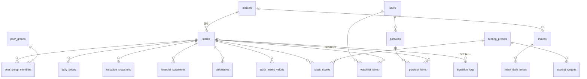

# 08. 최종 결과보고서

> 주식 분석 대시보드 — 국내·미국 주식 데이터 백엔드와 대시보드 (1차 세미프로젝트)
> 수치는 실제 실행 결과다. 데이터 현황(1·4절)과 테스트 수는 2026-10-08, 그 밖의 수치는 2026-10-06 기준이다. 상세 근거는 각 절에 적은 문서·파일을 따른다.

## 1. 프로젝트 개요
국내(KOSPI·KOSDAQ) 16개, 미국(NASDAQ) 9개 종목의 일봉·지수·환율·밸류에이션·재무·공시를 수집·전처리해 PostgreSQL에 정규화된 구조로 적재하고, SQL VIEW·윈도우 함수로 분석 지표와 매력도 점수(다중 팩터: 로버스트 Z·섹터 중립화·프리셋·100·Φ)를 계산해 FastAPI로 제공한다. 바닐라 HTML/CSS/JS 대시보드에서 지수·관심종목·순위·종목 분석·경쟁 비교와, 시드 안에서 종목을 담아 보는 원화 통합 모의 포트폴리오를 쓸 수 있다.

| 항목 | 내용 |
|---|---|
| 데이터 (2026-10-08) | 종목 146(노출 25 + 비교군 121) · 일봉 45,560행 · 지수 10종 4,970행 · 환율 DAILY 518행 · 밸류에이션 4,250행 · FY 재무 492행 · 공시 1,421행 |
| DB | PostgreSQL 16, 테이블 20 · VIEW 3 · 보조 인덱스 10 · 부분 UNIQUE 인덱스 1 · 트리거 2 · 생성 컬럼 1 |
| API | FastAPI, `/api/v1` 아래 25개 경로 · 31개 오퍼레이션 (Swagger `/docs`) |
| 화면 | 대시보드 홈 · 주식 리스트 · 종목 상세 · 모의 포트폴리오 (빌드 없는 ES Modules, Chart.js CDN) |
| 테스트 | pytest 127개 함수 / 213개 케이스 전부 통과, 수동 UI 점검 46항목 |
| 코드 규모 | Python 4,132줄 · SQL 859줄 · 프론트(HTML/CSS/JS) 2,163줄 · 테스트 1,204줄 (`wc -l`) |

## 2. 문제 정의
| # | 문제 | 해결 |
|---|---|---|
| P1 | 시세·재무·공시가 출처마다 형식·통화·시간대·회계기준이 다름 | Provider 인터페이스 뒤에서 수집, 전처리 후 정규화 스키마로 통합(시장 단위 속성 분리) |
| P2 | 수익률·변동성·MDD 같은 파생 지표를 매번 손으로 계산 | `v_stock_metrics` VIEW 하나로 일관 계산, 데이터 부족 시 NULL |
| P3 | 국내·해외 경쟁 종목을 같은 기준으로 비교하기 어려움 | 경쟁 그룹(N:M) + RANK/AVG OVER 비교표 + 기준일=100 환산 차트 + 원화 환산 시총 |
| P4 | 시드 배분·환율 영향을 엑셀로 계산 | 담은 시점 가격·환율을 고정 저장하는 장바구니형 모의 포트폴리오, 가격 효과/환율 효과 분리 |
| P5 | 비공식 라이브러리·외부 API 호출 비용과 차단 위험 | 작업 종류별 TTL(4시간) 1회 제한, advisory lock으로 동시 중복 호출 방지, 실패 시 마지막 값 |

## 3. 요구사항 (`docs/02`)
- 67개 요구사항 중 **필수 전부 구현·검증**, 선택 4개 미구현(분기 재무, 투자 스타일 체크리스트, 시나리오 API, 균등 배분 미리보기), 관심종목 정렬 변경은 API만 구현.
- 관심종목 CRUD(`POST·GET·PATCH·DELETE /watchlist`)와 모의 포트폴리오 CRUD(`/portfolios`, `/portfolios/{id}/items`, `/summary`)가 Swagger와 화면 양쪽에서 동작한다.

## 4. 활용 데이터 (`docs/03`)
| 데이터 | 국내 | 미국 | 적재 결과 (2026-10-08) |
|---|---|---|---|
| 일봉(수정주가) 2년 | pykrx | yfinance | 45,560행 (노출 12,310 · 비교군 33,250), 노출 종목당 487~502봉 |
| 지수 2년 | pykrx (KOSPI 1001·KOSDAQ 2001·KOSPI 200 1028) | yfinance (^GSPC·^IXIC·^DJI·^NDX·^RUT·^SOX·^VIX) | 10종 4,970행 |
| USD/KRW | yfinance `KRW=X` | (동일) | DAILY 518행 + SNAPSHOT(조회 시) |
| 시총·PER·PBR·EPS·BPS | pykrx 일별 1년 | yfinance 스냅샷 | 4,250행 (노출 3,684) |
| 재무 FY 5개년 | OpenDART 연결(CFS) | SEC companyfacts + yfinance 보완 | 492행 (노출 125 = 25종목×5 · 비교군 367) |
| 공시 1년 | OpenDART (지분공시 제외) | SEC submissions (Form 4 제외) | 1,421행 (노출 1,348) |

- 1단계 smoke test에서 pykrx 1.2.9가 KRX 로그인 없이 시총·펀더멘털·지수를 돌려주지 않는 것을 확인 → KRX 계정 로그인으로 해결하고, 국내 소스는 환경변수 `PRICE_SOURCE_KR`로 yfinance 전환이 가능하게 했다(밸류에이션은 DART 기반 파생 계산 폴백).
- 데이터 이용 조건: pykrx·yfinance는 비공식 라이브러리이며 원 사이트(KRX·Yahoo) 약관을 따른다. 저장소에는 4종목×6개월 샘플(136KB)만 커밋한다.

## 5. 데이터 전처리
| 규칙 | 구현 | 결과 |
|---|---|---|
| 수정주가 통일 | pykrx `adjusted=True`, yfinance `auto_adjust=True` | 전 종목 수정주가 |
| 시장 현지 날짜 | tz-aware 인덱스를 시장 시간대로 변환 후 date, 장 마감 전 당일 봉 제외 | KR 15:30·US 16:00 기준 |
| 결측·이상 행 격리 | 종가 결측·OHLCV 결측·가격 0 이하·고가<저가·음수 거래량·환율 튐(주변 중앙값 대비 5%) → 버리지 않고 `data/quarantine/*.csv` + `ingestion_logs`에 사유 | 전체 적재 격리 0행 |
| 중복 제거·재실행 안전 | 키 기준 중복 제거 + `INSERT … ON CONFLICT DO UPDATE` | 재실행 시 행 수 불변 (ING-01) |
| 실패 격리 | 종목·지수 단위로 `ingestion_logs` 기록, 지수 백오프 3회 재시도, 한 종목 실패가 전체를 멈추지 않음 | 빈 DB 전체 적재 257.2초, SUCCESS 109 · FAILED 0 |
| DART 계정 차이 | account_id 후보 → 계정명 후보 → 다음 해 보고서 전기값 | 카카오 "영업수익", POSCO홀딩스 "매출액" 등 대체 추출 기록 |
| SEC 보완 | 10-K FY(기간 350~380일), 결산일별 최신 제출값, 빈 값은 같은 결산기 yfinance로 | AMZN·AMD 부채, AVGO 순이익 보완, 남은 NULL 3건은 추정하지 않음 |

## 6. 도메인 모델 (`docs/04`)
명사 추출로 Entity 16개(Market, Stock, PeerGroup, DailyPrice, ValuationSnapshot, FinancialStatement, Disclosure, Index, IndexDailyPrice, FxRate, User, WatchlistItem, Portfolio, PortfolioItem, StockScore, IngestionLog)를 정하고, 파생값(수익률·변동성 등)은 Entity가 아니라 VIEW로, 원가는 생성 컬럼으로, 평가손익은 서비스 계산으로 분류했다.

## 7. ERD (`docs/05` 1절)

`fx_rates`는 FK 없는 독립 테이블이며, 담은 시점 환율은 `portfolio_items`에 복사한다.

## 8. DB 구현 (`db/*.sql`, `docs/05`)
- **정규화**: 통화·국가·시간대를 `markets`로 분리(이행적 종속 제거, 3NF), 종목↔경쟁 그룹·사용자↔종목은 교차 테이블(N:M), 파생 지표는 VIEW.
- **의도적 비정규화 2건**: ① `portfolio_items.ref_price·ref_fx_rate·ref_date` — 담은 시점의 불변 사실이라 시세 보정·환율 갱신이 원가를 소급 변경하면 안 됨. ② `stock_metric_values`·`stock_scores` — 국가별 중앙값·MAD·그룹 평균·재표준화를 매 조회마다 계산하지 않고 점수의 근거(지표 원값·Z)를 설명하기 위해 as_of별로 저장하는 재생성 가능한 파생 테이블.
- **제약조건**: PK·FK(CASCADE/RESTRICT/SET NULL)·UNIQUE·CHECK(가격>0, 고가≥저가, 수량>0, 시드>0, 점수 0~100, 값 목록 등), 생성 컬럼 `cost_krw = quantity × ref_price × ref_fx_rate`, `updated_at` 트리거. 위반 20종이 모두 거부됨(DB-03). 종목당 주 경쟁 그룹 1개는 부분 UNIQUE 인덱스, 프리셋 가중치 합 = 1은 행 간 제약이라 적재 시 검증.
- **행 간 제약** "원가 합계 ≤ 시드"는 CHECK로 불가 → 서비스에서 한 트랜잭션 + `SELECT … FOR UPDATE`. 잠금을 빼면 동시성 테스트가 실패하는 것을 확인해 테스트가 잠금을 실제로 검증함을 보였다.
- **인덱스와 EXPLAIN** (중앙값 7회, `docs/explain_result.md`):

| 쿼리 | 인덱스 | 행 수 | 인덱스 전 계획 | 전(ms) | 인덱스 후 계획 | 후(ms) |
|---|---|---|---|---|---|---|
| 종목별 최근 공시 5건 (종목 상세 '최근 공시') | `ix_disclosures_stock_filed` | 1,349 | Seq Scan | 0.040 | Index Scan (ix_disclosures_stock_filed) | 0.005 |
| 특정 거래일의 전 종목 시세 (거래량 순위·날짜 단위 조회) | `ix_daily_prices_trade_date` | 12,276 | Seq Scan | 0.233 | Bitmap Heap Scan, Bitmap Index Scan | 0.012 |
| 종목별 최신 FY 재무 5건 (재무 추이) | `ix_fin_stock_type_end` | 125 | Seq Scan | 0.007 | Seq Scan | 0.007 |
| 종목별 최신 밸류에이션 1행 — 삭제한 인덱스가 PK(stock_id, as_of)와 기능이 겹치는지 확인 (A-34) | `ix_valuation_stock_asof` | 3,881 | Index Scan Backward (valuation_snapshots_pkey) | 0.005 | Index Scan (ix_valuation_stock_asof) | 0.005 |

  명세의 `valuation_snapshots(stock_id, as_of DESC)`는 PK 역방향 스캔과 실행 시간이 같아(0.005ms) 중복으로 판단해 삭제했다(DB 품질 우선 원칙, A-34). `financial_statements` 인덱스는 125행 규모에서 아직 쓰이지 않지만 데이터 증가 대비로 유지했다.

## 9. FastAPI 구현 (`app/`)
| 계층 | 위치 | 역할 |
|---|---|---|
| 라우터 | `app/api/` market · stocks · watchlist · portfolios · analysis | 요청 검증(Pydantic v2), 응답 스키마(Swagger 문서) |
| 서비스 | `app/services/` fx · refresh · portfolio · scoring | TTL·advisory lock, 포트폴리오 계산(Decimal), 점수 재생성 |
| SQL | `app/queries/*.sql` 19개 (+ `db/views.sql`) | 조회·분석 쿼리 원문을 `text()`로 실행 |
| 모델 | `app/models/` | schema.sql과 1:1 ORM (테이블 20개, 차이 0건 — DB-01) |
| 수집 | `app/providers/`, `app/ingest/` | Provider 인터페이스 6종 + pykrx·yfinance·DART·SEC 구현, 적재 CLI |
| 공통 | `app/core/` | 설정, DB 세션, 오류 형식 `{"error": {code, message, detail}}`, 요청 ID 로깅 |

- **갱신 정책**: 작업 종류(FX·INDICES·PRICES·VALUATION·SCORES)별 마지막 성공 시각이 TTL(4시간) 이내면 `SKIPPED` 기록. TTL 이내 연속 호출 시 외부 호출 0회, 초과 시 작업별 정확히 1회, 동시 3요청도 한 번만 실행(RF-06~10).
- **환율**: 최신 SNAPSHOT이 TTL 이내면 DB 값, 아니면 advisory lock 안에서 한 번 조회. 실패 시 마지막 값 + `fx_stale`, 실패 후 15분 재시도 대기. 동시 6요청에서 외부 호출 1회(RF-05).
- **포트폴리오**: 수량/금액/비중 모드를 서버가 정수 수량으로 환산, 시드 초과 409(잔여·최대 수량 안내), 수량 0이면 422(최소 금액), 같은 종목 409(수정 안내), 요약에 시장·그룹 비중, 가중 매력도, 평가손익과 **가격 효과 + 환율 효과 분리**.

## 10. 프론트엔드 구현 (`web/`)
- **디자인 시스템**(`web/css/tokens.css`): 레퍼런스 이미지의 차콜 배경(#141414)·카드(#2a2a2a), 아이스 블루·라벤더 파스텔, 큰 라운드(카드 24~28px, 행 16px), Plus Jakarta Sans. 등락은 색 + ▲▼(국내 상승 빨강·하락 파랑, 미국 상승 초록·하락 빨강), 파스텔 위에서는 대비 4.5:1 이상의 진한 변형.
- **구성 요소 대응**: 파스텔 카드 → 관심종목 카드 / 세그먼트 탭(아이스 블루 알약) → 기간·정렬·시장 탭 / 둥근 막대 + 점선 기준선 + 흰 툴팁 → 수익률·재무·비중 차트 / 원형 이니셜 리스트 행 → 순위·포트폴리오 항목 / 라벤더 활성 메뉴 → 사이드바(768px 미만 하단 탭 바).
- **상태**: 모든 영역에 로딩 스켈레톤·빈 상태·오류 상태(다시 시도). 숫자 포맷은 `format.js` 하나(억·조, 달러, 부호, 퍼센트).
- **접근성**: 탭 `role=tab`·`aria-selected`·화살표 키, 버튼 `aria-label`, 모달 포커스 순환·ESC, 차트 `role=img` + `aria-label`.

## 11. 주요 SQL
### 11-1. `v_stock_metrics` — 기간 지표 (CTE + 윈도우 함수)
> 주요 CTE 발췌(앞부분). 재무 CTE는 11-2, 최종 SELECT를 포함한 전체 정의는 [`db/views.sql`](../db/views.sql)의 `v_stock_metrics`.

최근 N거래일은 `ROW_NUMBER`, 일수익률은 `LAG`, MDD는 누적 `MAX() OVER (ROWS UNBOUNDED PRECEDING)`, 변동성은 `STDDEV_SAMP × √252`. 기간이 다 차지 않으면 `CASE`로 NULL을 돌려준다.
```sql
WITH latest AS (                      -- 기준: 종목별 최신 거래일
    SELECT lp.stock_id, lp.market, lp.country, lp.currency,
           lp.trade_date AS as_of, lp.close, lp.change_rate, lp.volume
    FROM v_latest_price lp
),
recent AS (                           -- 최신일부터 거꾸로 거래일 번호(rn=1이 최신)
    SELECT d.stock_id, d.trade_date, d.close, d.volume,
           ROW_NUMBER() OVER (PARTITION BY d.stock_id ORDER BY d.trade_date DESC) AS rn
    FROM daily_prices d
),
daily_ret AS (                        -- 최근 253개 종가 → 252개 일수익률
    SELECT r.stock_id, r.rn, r.trade_date, r.close,
           r.close / NULLIF(LAG(r.close) OVER (PARTITION BY r.stock_id ORDER BY r.trade_date), 0) - 1 AS ret
    FROM recent r
    WHERE r.rn <= 253
),
risk AS (                             -- 연환산 변동성: 252개 일수익률이 모두 있을 때만
    SELECT dr.stock_id,
           CASE WHEN COUNT(dr.ret) = 252
                THEN STDDEV_SAMP(dr.ret) * SQRT(252::numeric) END AS volatility_1y
    FROM daily_ret dr
    GROUP BY dr.stock_id
),
drawdown AS (                         -- 최근 252거래일 누적 고점 대비 낙폭
    SELECT r.stock_id, r.rn,
           r.close / MAX(r.close) OVER (PARTITION BY r.stock_id ORDER BY r.trade_date
                                        ROWS UNBOUNDED PRECEDING) - 1 AS dd
    FROM recent r
    WHERE r.rn <= 252
),
mdd AS (
    SELECT dd.stock_id,
           CASE WHEN COUNT(*) = 252 THEN MIN(dd.dd) END AS max_drawdown_1y
    FROM drawdown dd
    GROUP BY dd.stock_id
),
ma AS (                               -- 이동평균: 해당 기간 거래일 수가 다 찼을 때만
    SELECT r.stock_id,
           CASE WHEN COUNT(*) FILTER (WHERE r.rn <= 20)  = 20  THEN AVG(r.close) FILTER (WHERE r.rn <= 20)  END AS ma20,
           CASE WHEN COUNT(*) FILTER (WHERE r.rn <= 60)  = 60  THEN AVG(r.close) FILTER (WHERE r.rn <= 60)  END AS ma60,
           CASE WHEN COUNT(*) FILTER (WHERE r.rn <= 120) = 120 THEN AVG(r.close) FILTER (WHERE r.rn <= 120) END AS ma120,
           -- 거래량 기준: 최신일을 제외한 직전 20거래일 평균
           CASE WHEN COUNT(*) FILTER (WHERE r.rn BETWEEN 2 AND 21) = 20
                THEN AVG(r.volume) FILTER (WHERE r.rn BETWEEN 2 AND 21) END AS avg_volume_20d
    FROM recent r
    WHERE r.rn <= 120
    GROUP BY r.stock_id
),
range_52w AS (                        -- 52주(기준일로부터 1년) 고가·저가 (일중 고가·저가 기준)
    SELECT l.stock_id,
           MAX(d.high) AS high_52w,
           MIN(d.low)  AS low_52w
    FROM latest l
    JOIN daily_prices d
      ON d.stock_id = l.stock_id
     AND d.trade_date >  (l.as_of - INTERVAL '1 year')::date
     AND d.trade_date <= l.as_of
    GROUP BY l.stock_id
),
-- … fy·fin CTE(11-2) 다음 최종 SELECT: 기간 수익률(1주~1년 전 가장 가까운 거래일 종가, LEFT JOIN LATERAL),
--     변동성·MDD·이동평균·52주 범위(1년치가 있을 때만)·거래량 비율, 최신 밸류에이션·환율(원화 시총)·최신 FY 재무를 결합
```
### 11-2. `v_stock_metrics` — 재무 지표 (직전 FY는 결산일 간격으로 확인)
> 같은 VIEW의 재무 CTE 발췌. 전체 정의는 [`db/views.sql`](../db/views.sql).

```sql
fy AS (                               -- FY 재무 + 직전 FY (결산일 간격이 약 1년일 때만 직전 FY로 인정)
    SELECT f.stock_id, f.period_end, f.revenue, f.operating_income, f.net_income,
           f.total_equity, f.total_debt, f.accounting_std,
           LAG(f.period_end)       OVER w AS prev_end,
           LAG(f.revenue)          OVER w AS prev_revenue,
           LAG(f.operating_income) OVER w AS prev_operating_income,
           ROW_NUMBER() OVER (PARTITION BY f.stock_id ORDER BY f.period_end DESC) AS rn
    FROM financial_statements f
    WHERE f.period_type = 'FY'
    WINDOW w AS (PARTITION BY f.stock_id ORDER BY f.period_end)
),
fin AS (
    SELECT fy.stock_id, fy.period_end AS fin_period_end, fy.accounting_std,
           fy.operating_income / NULLIF(fy.revenue, 0)       AS operating_margin,
           CASE WHEN fy.total_equity > 0 THEN fy.net_income / fy.total_equity END AS roe,
           fy.total_debt / NULLIF(fy.total_equity, 0)        AS debt_ratio,
           CASE WHEN fy.prev_end BETWEEN fy.period_end - 400 AND fy.period_end - 330
                THEN (fy.revenue - fy.prev_revenue) / NULLIF(ABS(fy.prev_revenue), 0) END AS revenue_yoy,
           CASE WHEN fy.prev_end BETWEEN fy.period_end - 400 AND fy.period_end - 330
                THEN (fy.operating_income - fy.prev_operating_income)
                     / NULLIF(ABS(fy.prev_operating_income), 0) END AS operating_income_yoy
    FROM fy
    WHERE fy.rn = 1
)
```
### 11-3. 매력도 점수 — 국가 내 로버스트 Z → 섹터 중립화 → 프리셋 가중 평균 → 100·Φ (`app/queries/score_*.sql`, docs/09)
지표 9종을 같은 시장 안에서 중앙값·MAD로 표준화하고(표본 < 5나 MAD = 0이면 평균·표준편차), 방향 반영 후 ±3으로 자른다.
```sql
WITH v AS (
    SELECT mv.stock_id, mv.metric, mv.raw_value, mk.country
    FROM stock_metric_values mv
    JOIN stocks s   ON s.stock_id = mv.stock_id
    JOIN markets mk ON mk.market_id = s.market_id
    WHERE mv.as_of = :as_of AND mv.raw_value IS NOT NULL AND mv.z_raw IS NULL
),
med AS (                              -- 국가·지표별 중앙값과 평균·표준편차
    SELECT v.country, v.metric, COUNT(*) AS n,
           PERCENTILE_CONT(0.5) WITHIN GROUP (ORDER BY v.raw_value) AS m,
           AVG(v.raw_value)         AS mean,
           STDDEV_SAMP(v.raw_value) AS sd
    FROM v
    GROUP BY v.country, v.metric
),
mad AS (                              -- MAD = 중앙값으로부터의 절대 편차의 중앙값
    SELECT v.country, v.metric,
           PERCENTILE_CONT(0.5) WITHIN GROUP (ORDER BY ABS(v.raw_value - med.m)) AS mad
    FROM v
    JOIN med ON med.country = v.country AND med.metric = v.metric
    GROUP BY v.country, v.metric
),
z AS (
    SELECT v.stock_id, v.metric,
           CASE WHEN med.n >= 5 AND mad.mad > 0 THEN (v.raw_value - med.m) / (1.4826 * mad.mad)
                WHEN med.sd > 0                 THEN CAST((v.raw_value - med.mean) / med.sd AS double precision)
                ELSE 0 END AS z
    FROM v
    JOIN med ON med.country = v.country AND med.metric = v.metric
    JOIN mad ON mad.country = v.country AND mad.metric = v.metric
)
UPDATE stock_metric_values t
SET z_raw = LEAST(3, GREATEST(-3, CASE WHEN t.metric = ANY(CAST(:negatives AS text[])) THEN -z.z ELSE z.z END))
FROM z
WHERE t.as_of = :as_of AND t.stock_id = z.stock_id AND t.metric = z.metric
```
주 그룹 평균을 n/(n+k)로 축소해 뺀 z_adj의 팩터 평균을 프리셋 가중치로 합산하고(유효 팩터 3개 이상, 재정규화), 같은 시장 안에서 다시 표준화해 erf로 0~100으로 바꾼다. Min-Max를 쓰지 않아 종목이 추가돼도 기존 점수가 0·100으로 재배치되지 않는다.
```sql
comp AS (
    SELECT wide.*, CASE WHEN wide.coverage >= 3 THEN wide.weighted END AS composite
    FROM wide
),
zc AS (                               -- 국가·프리셋 안에서 종합 점수를 다시 표준화 (NULL은 통계에서 제외)
    SELECT comp.*,
           AVG(comp.composite)         OVER (PARTITION BY comp.preset_id, comp.country) AS c_mean,
           STDDEV_SAMP(comp.composite) OVER (PARTITION BY comp.preset_id, comp.country) AS c_sd
    FROM comp
)
SELECT zc.stock_id, zc.preset_id, zc.country, zc.coverage AS factor_coverage,
       ROUND(zc.value_score, 4)    AS value_score,
       ROUND(zc.quality_score, 4)  AS quality_score,
       ROUND(zc.growth_score, 4)   AS growth_score,
       ROUND(zc.safety_score, 4)   AS safety_score,
       ROUND(zc.momentum_score, 4) AS momentum_score,
       ROUND(zc.composite, 4)      AS composite,
       CASE WHEN zc.composite IS NOT NULL THEN
         ROUND(CAST(100 * 0.5 * (1 + erf(CAST(CASE WHEN zc.c_sd > 0 THEN (zc.composite - zc.c_mean) / zc.c_sd ELSE 0 END
                                             AS double precision) / sqrt(2::double precision))) AS numeric), 2)
       END AS score
FROM zc
```
### 11-4. 경쟁 비교 — 그룹 내 RANK와 그룹 평균 (`app/queries/peers.sql`)
```sql
SELECT b.*,
       CASE WHEN b.return_1m IS NOT NULL THEN RANK() OVER (PARTITION BY b.group_id, b.return_1m IS NULL ORDER BY b.return_1m DESC) END AS return_1m_rank,
       CASE WHEN b.return_3m IS NOT NULL THEN RANK() OVER (PARTITION BY b.group_id, b.return_3m IS NULL ORDER BY b.return_3m DESC) END AS return_3m_rank,
       CASE WHEN b.return_1y IS NOT NULL THEN RANK() OVER (PARTITION BY b.group_id, b.return_1y IS NULL ORDER BY b.return_1y DESC) END AS return_1y_rank,
       CASE WHEN b.per IS NOT NULL THEN RANK() OVER (PARTITION BY b.group_id, b.per IS NULL ORDER BY b.per ASC) END AS per_rank,
       CASE WHEN b.pbr IS NOT NULL THEN RANK() OVER (PARTITION BY b.group_id, b.pbr IS NULL ORDER BY b.pbr ASC) END AS pbr_rank,
       CASE WHEN b.roe IS NOT NULL THEN RANK() OVER (PARTITION BY b.group_id, b.roe IS NULL ORDER BY b.roe DESC) END AS roe_rank,
       CASE WHEN b.operating_margin IS NOT NULL THEN RANK() OVER (PARTITION BY b.group_id, b.operating_margin IS NULL ORDER BY b.operating_margin DESC) END AS operating_margin_rank,
       CASE WHEN b.revenue_yoy IS NOT NULL THEN RANK() OVER (PARTITION BY b.group_id, b.revenue_yoy IS NULL ORDER BY b.revenue_yoy DESC) END AS revenue_yoy_rank,
       CASE WHEN b.market_cap_krw IS NOT NULL THEN RANK() OVER (PARTITION BY b.group_id, b.market_cap_krw IS NULL ORDER BY b.market_cap_krw DESC) END AS market_cap_krw_rank,
       CASE WHEN b.score IS NOT NULL THEN RANK() OVER (PARTITION BY b.group_id, b.score IS NULL ORDER BY b.score DESC) END AS score_rank,
       -- 그룹 평균 (AVG는 NULL을 제외하고 계산)
       ROUND(AVG(b.return_1m) OVER g, 6)        AS return_1m_avg,
       ROUND(AVG(b.return_3m) OVER g, 6)        AS return_3m_avg,
       ROUND(AVG(b.return_1y) OVER g, 6)        AS return_1y_avg,
       ROUND(AVG(b.per) OVER g, 4)              AS per_avg,
       ROUND(AVG(b.pbr) OVER g, 4)              AS pbr_avg,
       ROUND(AVG(b.roe) OVER g, 6)              AS roe_avg,
       ROUND(AVG(b.operating_margin) OVER g, 6) AS operating_margin_avg,
       ROUND(AVG(b.revenue_yoy) OVER g, 6)      AS revenue_yoy_avg,
       ROUND(AVG(b.market_cap_krw) OVER g, 0)   AS market_cap_krw_avg,
       ROUND(AVG(b.score) OVER g, 2)            AS score_avg
FROM base b
WINDOW g AS (PARTITION BY b.group_id)
```
### 11-5. 시장별 밸류에이션 — GROUP BY + HAVING (`app/queries/stats_market_valuation.sql`)
```sql
SELECT mk.code AS market, mk.country, mk.currency,
       COUNT(*)                                                AS stocks,
       COUNT(vm.per) FILTER (WHERE vm.per > 0)                 AS per_samples,
       ROUND(AVG(vm.per) FILTER (WHERE vm.per > 0), 2)         AS avg_per,
       ROUND(MIN(vm.per) FILTER (WHERE vm.per > 0), 2)         AS min_per,
       ROUND(MAX(vm.per) FILTER (WHERE vm.per > 0), 2)         AS max_per,
       ROUND(AVG(vm.pbr) FILTER (WHERE vm.pbr > 0), 2)         AS avg_pbr,
       ROUND(AVG(vm.roe), 4)                                   AS avg_roe,
       ROUND(SUM(vm.market_cap_krw), 0)                        AS total_market_cap_krw
FROM v_stock_metrics vm
JOIN stocks s   ON s.stock_id = vm.stock_id
JOIN markets mk ON mk.market_id = s.market_id
WHERE s.is_active
GROUP BY mk.code, mk.country, mk.currency
HAVING COUNT(*) >= :min_samples
ORDER BY total_market_cap_krw DESC NULLS LAST
```
SQL 요소(SELECT·WHERE·JOIN·GROUP BY·HAVING·ORDER BY·AVG·SUM·COUNT·MAX·MIN·윈도우 함수·CTE) 사용 현황은 `docs/05` 9절 표 참고(누락 없음).

## 12. 실행 결과 (스크린샷: `docs/screenshots/`)
| 파일 | 화면 |
|---|---|
| `01_home.png` | 대시보드 홈 — 투자 성향 메뉴, 지수 5·USD/KRW 카드, 관심종목 카드(매력도 게이지·가격·등락률), 거래량 상위 5 |
| `02_stocks.png` | 주식 리스트 — 국내 탭 거래량 순위, ★·담기 |
| `03_stock_detail.png` | 종목 상세(삼성전자) — 가격 차트, 핵심 지표, 매력도(투자 성향·국가 내 순위·팩터 기여도·지표 표), 수치 분석, 재무, 경쟁 비교, 공시 |
| `04_stock_detail_us.png` | 종목 상세(NVIDIA) — 원화 환산가, 미국식 등락 색, US-GAAP 재무 |
| `05_portfolio.png` | 모의 포트폴리오 — 요약, 담기 패널, 비중 도넛·막대, 담은 종목 |
| `06~08_mobile_*.png` | 390px 화면 — 하단 탭 바, 카드·리스트 세로 배치 |
| `09_add_modal.png` | 담기 모달 — 비중 모드 미리보기 |
| `10_swagger.png` | Swagger UI |

API 실제 응답 예시 35개는 `docs/06` 3절, 적재 결과는 `docs/03` 5절.

## 13. 테스트 결과 (`docs/07`)
**213 passed** — 별도 테스트 DB, 외부 호출 없는 fake provider(호출 횟수 기록). 실행 시간·환경은 `docs/07` 1절.

| 분류 | 핵심 검증 |
|---|---|
| DB | ORM↔DDL 차이 0, 제약 위반 16종 거부, 생성 컬럼·트리거·삭제 규칙 |
| 수집 | upsert 재실행 행 수 불변, 실패 격리, 이상 행 격리 사유, DART 계정 대체, SEC 보완 |
| 갱신·환율 | TTL 이내 외부 호출 0회, TTL 초과 시 작업별 1회, 증분 시작일, 실패 시 마지막 값 + stale, 동시 요청 1회 |
| 분석 SQL | v_stock_metrics 22개 지표 손계산 일치, 그룹 RANK·평균, 구성원 1명 그룹, 합집합 날짜 null, HAVING |
| 매력도 | 로버스트 Z·부호 반전·±3 클리핑·MAD = 0 대체, 축소 계수 n/(n+k), 재정규화·유효 팩터 3개 미만 NULL, Φ(0) = 50·Φ(1) = 84.13, 파이썬 참조 구현과 전 과정 일치, 적자·자본 ≤ 0·직전 매출 0·일봉 부족 경계, 프리셋 합 = 1, Min-Max 재배치 없음 |
| 포트폴리오 | 명세 고정 시나리오(42주·2,940,000 / 11주·2,860,000 / 잔여 4,200,000 / 평가 3,234,000 · 손익 +374,000(+13.08%) · 종목통화 +5.0%), 시드 초과·축소 409, 동시 담기 |
| 통합 | 화면·정적 파일 서빙, 프론트 import 경로, 화면 흐름 사용자 시나리오 |
| 사용자·소유권 | 요청 사용자 = `get_current_user_id()`(1차는 `DEFAULT_USER_ID`), 사용자 2명 교차 접근 10종 모두 404 + 데이터 불변, 요청의 `user_id` 무시 |

수동 UI 점검 46항목은 헤드리스 브라우저로 확인했으며(07 부록), 사람이 직접 확인하는 열은 비워 두었다.

## 14. 문제점 및 해결방법
| # | 문제 | 원인 | 해결 |
|---|---|---|---|
| 1 | pykrx 시총·펀더멘털·지수가 빈 결과 | pykrx 1.2.x가 KRX 로그인 요구, import 시점에 환경변수를 읽음 | KRX 계정 + `.env` 값을 import 전에 환경변수로 내보냄. yfinance 전환·DART 파생 폴백 유지 |
| 2 | SEC 403 | 연락처 없는 User-Agent는 일부 경로 차단 | API 키는 없고 이메일 포함 UA 필수임을 실측으로 확인해 설정 |
| 3 | DART 계정 ID가 회사·연도마다 다름 | 표준계정코드 미사용, 다른 계정 ID | account_id → 계정명 → 다음 해 전기값 순서의 매핑, 대체 내역 로그 |
| 4 | "최근 공시 5건"이 임원 지분 보고로 채워짐 | 삼성전자 1년 2,851건 중 2,730건이 지분공시 | DART 지분공시(D)·SEC Form 4 제외 |
| 5 | 증분 적재가 이전 봉을 다시 받음 / 당일 환율이 고정됨 | yfinance가 시작일 이전 마지막 봉 반환, 외환은 24시간 거래 | 요청 구간 밖 행 제거, 환율은 마지막 일자부터 다시 받아 upsert |
| 6 | SQL 실행 오류 | 주석 속 `%`·`:limit개`를 placeholder로 해석, `PERCENT_RANK`가 double이라 `ROUND(x, 2)` 불가 | SQL 파일은 파라미터 없이 실행, 주석 수정, `CAST(… AS numeric)` |
| 7 | 로컬 5432 포트 충돌 | 다른 프로젝트의 PostgreSQL 컨테이너 | 이 프로젝트 DB를 5433으로 |
| 8 | "다음 갱신 가능 시각"이 항상 지금 | 아직 실행할 수 없는 SCORES 작업이 최소값을 결정 | 실행 가능한 작업만 계산 |
| 9 | 503 응답 시 환율 실패 로그가 사라짐 | 같은 트랜잭션이 롤백 | 실패 로그를 별도 트랜잭션으로 기록 |
| 10 | 중복 인덱스 | PK 역방향 스캔과 기능 중복 | EXPLAIN 비교 후 삭제(측정은 임시 생성으로 재현 가능) |
| 11 | 화면: 열 어긋남·숨김 안내 노출·입력값 초기화 등 7건 | 행별 grid의 auto 열, `display`가 `hidden`보다 우선, 포커스 이동 시 change 재발생 | 고정 열 폭, `[hidden]` 우선 규칙, 같은 종목 재선택 무시 (07 부록 UI 항목에 기록) |
| 12 | 샘플 데이터로 재현 시 `seed-demo` 실패 | 데모 포트폴리오에 샘플에 없는 종목(AVGO 등) 포함 | 시세 없는 종목·빈 포트폴리오는 건너뛰고 보고(A-79), 깨끗한 DB에서 재현 절차 재검증 |
| 13 | `portfolio_id`만 알면 다른 사용자의 포트폴리오를 조회·수정·삭제 가능 | API가 클라이언트의 `user_id`를 그대로 신뢰하고, 포트폴리오 단건 조회에 소유자 조건이 없었음 | `user_id` 파라미터 제거 → `get_current_user_id()` 의존성(1차는 `DEFAULT_USER_ID`), 서비스가 요청 사용자 소유만 조회하고 남의 리소스는 404(A-57·A-82). 교차 접근 테스트로 재현 후 수정(07 USR-02~05) |
| 14 | 국내 적자 기업의 E/P가 비어 매력도에서 빠짐 | KRX가 적자 기업 EPS를 제공하지 않음(LG에너지솔루션·삼성SDI·현대제철) | EPS가 없으면 FY 순이익 / 주식수로 대체해 적자가 E/P 하위로 가게 하고 `data_quality.notes`에 기록(A-85) |
| 15 | 일부 종목 변동성·모멘텀 계산 불가 | 샘플 데이터(6개월) 위에 증분 적재해 일봉이 122~128개뿐 | 해당 4종목 `prices --full` 재적재(A-95). 일봉 253개 미만이면 모멘텀은 6-1개월로 대체 |
| 16 | 어떤 성향을 골라도 Tesla 매력도가 2~3점 | 미국 비교 표본이 초대형 기술주 9개뿐이라 꼴찌가 0점 근처로 쏠림 + 섹터 중립화가 국가를 섞어 국내 자동차의 저평가 Z가 Tesla 평균에 들어감 | 그룹 평균을 같은 국가끼리로 변경, 국가별 섹터당 시가총액 상위 10개 비교군(121종목) 도입 → 28.69점(미국 76개 중 62위). 비교군은 평시 필수 데이터만 1일 갱신, 상세는 요청 시 수집, DART 분당 제한 보호, 앱 안 스케줄러 |

## 15. 회고
- **잘한 점**: 외부 데이터를 추측하지 않고 smoke test로 실제 응답을 확인한 뒤 구현해, pykrx 로그인·SEC UA·DART 계정 차이·공시 편중을 초기에 발견했다. 분석 SQL을 손계산 테스트로 고정해 VIEW를 고쳐도 회귀를 바로 확인할 수 있다. 문서의 수치(행 수·EXPLAIN·API 예시·테스트 결과)를 스크립트가 실제 실행 결과로 만들게 해 코드와 문서가 어긋나지 않는다.
- **아쉬운 점**: 선택 기능 4개(분기 재무·체크리스트·시나리오·균등 배분)를 하지 못했다. KRX가 제공하는 EPS 산정 기준을 확인하지 못해 DART 기반 값과 차이가 있다(A-38). 데이터 규모가 작아 인덱스 효과가 ms 미만으로 나타난다. 증분 적재는 과거 수정주가의 소급 조정을 반영하지 못해 주기적 `--full` 재적재가 필요하다.
- **다음 단계(2·3차)**: React 전환, 로그인 도입 — 1차는 로컬·시연 전용 단일 사용자(데모) 모드이고, 요청 사용자를 정하는 `get_current_user_id()`만 JWT 검증으로 교체하면 라우터·서비스·소유권 검사는 그대로 사용자별로 동작한다. 캐시·작업 큐·스케줄러. `stock_scores.data_quality`와 분석 응답을 JSON 구조로 만들어 두었으므로 3차의 LLM 종목 보고서 입력으로 그대로 쓸 수 있다.

## 16. 발표 흐름 (약 10분)
| 순서 | 시간 | 내용 | 보여줄 것 |
|---|---|---|---|
| 1 | 1분 | 문제와 목표: 흩어진 국내·미국 데이터를 하나의 DB로, 비교·모의 계산까지 | 2절 표 |
| 2 | 1분 | 데이터 확보 과정: smoke test로 발견한 문제 4가지 | `docs/smoke_test_result.md`, 14절 1~4 |
| 3 | 2분 | DB 설계: ERD, markets 분리(3NF), N:M 교차 테이블, 의도적 비정규화 2건, 생성 컬럼 | `docs/05` ERD·5절 |
| 4 | 2분 | SQL: v_stock_metrics(CTE·LAG·누적 MAX·STDDEV), 매력도(PERCENTILE_CONT 중앙값·MAD Z, 축소 추정, erf로 100·Φ), 경쟁 비교 RANK/AVG, HAVING · 인덱스 EXPLAIN 전후 | 11절, 8절 EXPLAIN 표 |
| 5 | 2분 | 시연: 홈 → 주식 리스트(전체 탭 거래량 비활성 이유) → 삼성전자 상세(경쟁 비교 표·기준일=100) → ★ | 실행 중인 화면 |
| 6 | 1분 | 시연: 모의 포트폴리오 담기 → 시드 초과 시 409와 최대 수량 → Swagger에서 같은 API | 화면 + `/docs` |
| 7 | 1분 | 품질: 213개 테스트(명세 시나리오 손계산, 매력도 참조 구현 비교, TTL 외부 호출 0회, 잠금 제거 시 실패, 사용자 간 교차 접근 404), 남은 한계와 다음 단계 | `docs/07`, 15절 |

시연 전 준비: `docker compose up -d`(db + api) → 브라우저 `/`. 갱신 버튼은 TTL 이내면 외부 호출 없이 "이미 최신"을 보여준다(네트워크 상황과 무관하게 시연 가능).
