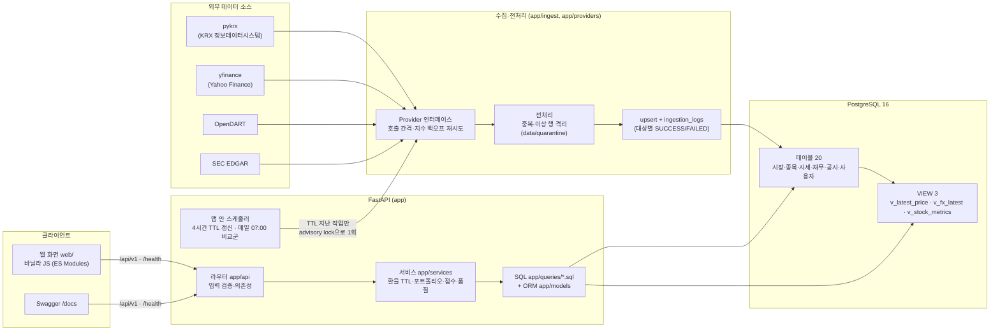
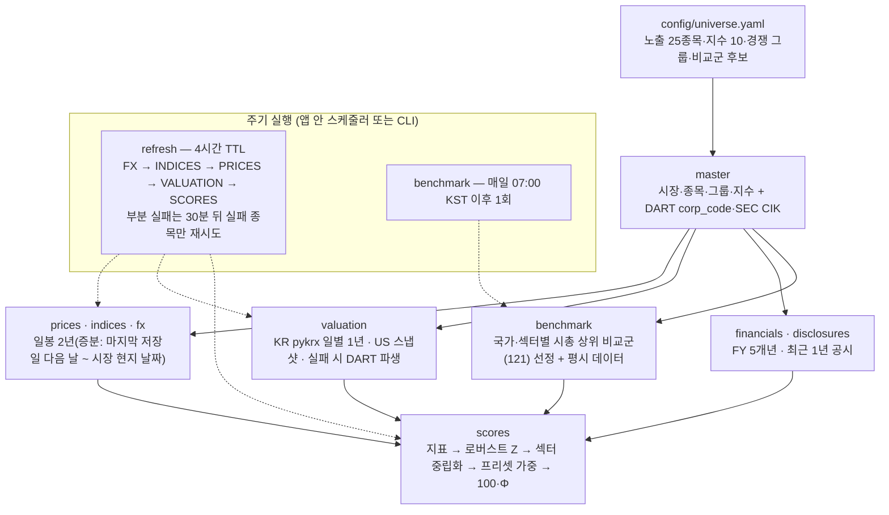
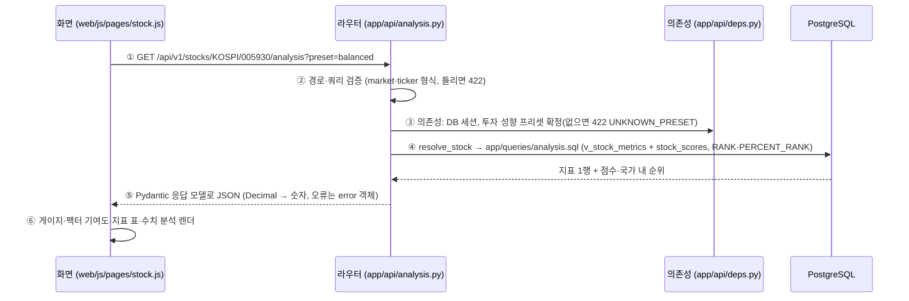

# 아키텍처

StockMind의 구성 요소, 데이터 적재 흐름, 요청 하나가 처리되는 순서, 주요 설계 결정을 한 장에 모은 문서다. 상세는 각 절에 링크한 문서를 따른다.

## 1. 전체 구성도

- **외부 호출은 수집 쪽에서만** 한다. 조회 API는 DB에 저장된 값을 읽고, 환율 현재값만 TTL(4시간)이 지났을 때 한 번 외부를 부른다(`docs/06` 1절 "외부 소스 장애 시 동작").
- **같은 작업이 겹치지 않게** PostgreSQL advisory lock을 쓴다: 갱신(`REFRESH_LOCK_KEY`), 환율 조회, DART 재무·공시(분당 호출 제한 보호), 스케줄러.
- 컨테이너는 `db`(PostgreSQL)와 `api`(uvicorn + 스케줄러) 두 개다(`compose.yml`). `api`의 HEALTHCHECK는 `/health/db`.

## 2. 데이터 적재 흐름

- 대상마다 `ingestion_logs`에 1행을 남기고 한 종목이 실패해도 나머지는 계속 적재한다. 이상 행은 버리지 않고 `data/quarantine/*.csv`에 사유와 함께 보관한다.
- 갱신 TTL은 작업 단위 기록(`source = 'REFRESH'`)으로 판단한다(A-109). 적재 상태는 `GET /api/v1/statistics/data-quality`·`python -m app.ingest status`로 확인한다.

## 3. 요청 흐름 예시 — 종목 상세의 매력도·수치 분석

| 단계 | 하는 일 | 코드 |
|---|---|---|
| ① 요청 | 화면이 `api.js`로 호출, 모든 응답에 `X-Request-ID` | `web/js/api.js`, `app/main.py` 미들웨어 |
| ② 검증 | 경로·쿼리·본문의 형식·범위(A-112). 틀리면 DB에 가기 전에 422 | `app/api/deps.py` `MarketPath`·`TickerPath` |
| ③ 의존성 | DB 세션·프리셋 확정. **사용자 데이터 API(관심종목·포트폴리오)는 같은 자리에서 `get_current_user_id()`로 요청 사용자를 확정**하고 소유자만 조회(남의 리소스는 404) | `get_db`, `get_preset`, `get_current_user_id` |
| ④ SQL | 원문 SQL을 `text()`로 실행. 지표는 VIEW `v_stock_metrics`(CTE·윈도우 함수), 순위는 `RANK()` | `app/queries/analysis.sql`, `db/views.sql` |
| ⑤ 응답 | Pydantic 모델로 직렬화, 금액·비율은 Decimal 계산 후 숫자. 예외는 `AppError` 계열 → `{"error": {"code","message","detail"}}` | `app/schemas`, `app/core/errors.py` |
| ⑥ 화면 | 로딩·빈 상태·오류 상태는 공통 컴포넌트(`load()`) | `web/js/components/ui.js` |

## 4. 주요 설계 결정

| 결정 | 내용 | 상세 |
|---|---|---|
| 도메인·데이터 선택 | 국내(KOSPI·KOSDAQ)·미국(NASDAQ) 주식은 공개 데이터로 시세·재무·공시를 모두 얻을 수 있고, 통화·시간대·회계기준이 달라 **정규화·JOIN·집계·윈도우 함수**를 보여 주기 좋다 | `docs/01`, `docs/03` |
| `markets` 분리(3NF) | 국가·통화·시간대는 종목이 아니라 시장에 종속 → `stocks.market_id`로 이행적 종속 제거 | `docs/05` 4-3 |
| 의도적 비정규화 ① | `portfolio_items.ref_price·ref_fx_rate·ref_date` — 담은 시점의 불변 사실이라 시세가 갱신돼도 원가가 바뀌지 않게 복사 저장 | `docs/05` 5-1 |
| 의도적 비정규화 ② | `stock_metric_values`·`stock_scores` — 매력도 파생 결과를 저장해 순위·설명을 매번 다시 계산하지 않음 | `docs/05` 5-2 |
| TTL 갱신 정책 | 같은 종류 외부 호출은 4시간에 1회, 작업 단위 기록으로 판단, 부분 실패는 30분 뒤 실패 종목만 재시도, 시장 현지 날짜까지만 요청 | README 갱신 정책, A-109·A-110 |
| 예외처리 원칙 | 응답 형식 하나(`{"error": {...}}`), 형식 오류는 DB 전에 422, 남의 리소스는 404로 숨김, 처리하지 못한 예외는 내부 정보 없이 500(요청 ID로 로그 추적), 외부 장애는 마지막 값·stale 표시 | `docs/06` 1절·5절 |
| 대시보드 지표 선정 | 국내·미국 대표 지수 + USD/KRW(미국 종목의 원화 환산·환율 효과 분리에 필요), 사용자가 지수 10개 중 고름. 순위는 거래량(시장별)·1개월·1년 수익률, 매력도는 같은 시장 안 상대 위치(5개 팩터) | A-111·A-115, `docs/09` |
| 인증 | 1차는 단일 사용자(데모) 모드, 로컬·시연 전용. 2차에서 `get_current_user_id()`만 JWT 검증으로 교체 | A-57·A-82 |

- **LLM 연동**: 1차 범위 제외(세미프로젝트 규격). 3차 예정 — `GET /api/v1/statistics/data-quality`와 `stock_scores.data_quality`의 JSON 구조가 입력으로 쓰일 예정이다.
